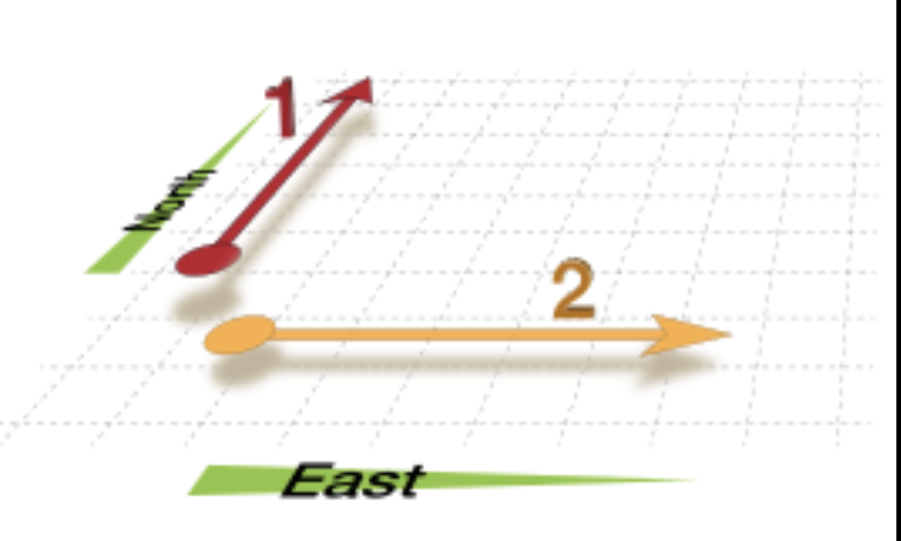
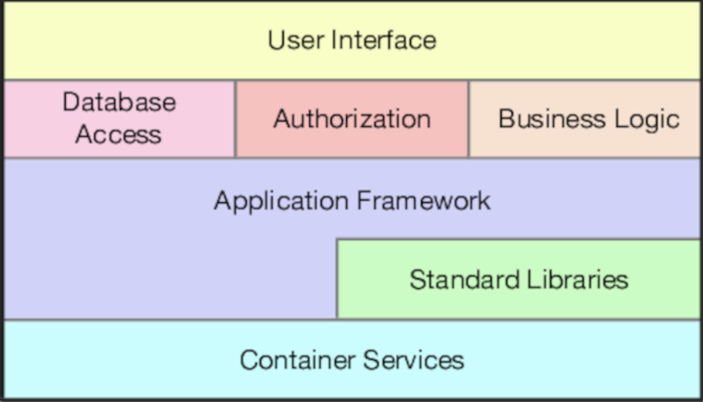

# 正交性
<!-- 2020.03.06 -->

如果要生产易于设计，构建，测试和扩展的系统，则正交性是一个至关重要的概念。 但是，正交性的概念很少直接讲授。 通常，它是您学习的其他各种方法和技术的隐含功能。 这是个错误。 学习直接应用正交性原理后，您会发现所生产系统的质量立即得到改善。

## 什么是正交性？
“正交”是从几何学借来的术语。 如果两条线成直角相交，则它们是正交的，例如图形上的轴。 用矢量表示，两条线是独立的。 当图表上的数字1向北移动时，它不会改变它向东或向西移动的距离。 数字2向东移动，但不向北或向南移动。
在计算中，该术语表示一种独立性或去耦性。 如果一个或多个变化不影响其他任何一个，则两个或多个事物是正交的。 在设计良好的系统中，数据库代码将与用户界面正交：您可以在不影响数据库的情况下更改界面，并在不更改界面的情况下交换数据库。



在研究正交系统的好处之前，我们先来看一下非正交系统。

### 一个非正交系统
你在乘坐直升机游览大峡谷的时候，飞行员明显犯了午饭吃鱼的错误，突然呻吟并晕倒。幸运的是，他让你在离地100英尺的地方盘旋。

幸运的是，你前一天晚上读过一个关于直升机的维基百科页面。你知道直升机有四个基本控制装置。循环是你右手拿的棍子。移动它，直升机就会向相应的方向移动。你的左手握着集体投球杆。拉起这个，你增加了所有叶片的螺距，产生升力。在俯仰杆的末端是油门。最后，你有两个脚踏板，可以改变尾桨的推力，从而帮助直升机转弯。

“别紧张！“你想。轻轻地降低集体投球杆，你将优雅地降落到地面，像一个英雄一样。然而，当你尝试的时候，你会发现事情并不是那么简单。直升机的机头下降，你开始向左盘旋。突然你发现你在驾驶一个系统，每个控制输入都有次要的影响。降低左侧操纵杆，您需要向右侧斗杆添加补偿向后移动并踩下右侧踏板。但是，这些更改都会再次影响所有其他控件。突然间，你在一个难以置信的复杂系统中游刃有余，每一个变化都会影响到所有其他的输入。你的工作量是惊人的：你的手和脚不断地移动，试图平衡所有相互作用的力量。

直升机的控制系统显然不是正交的。

### 正交的好处

如直升机的示例所示，非正交系统本质上更难以更改和控制。 当任何系统的组件高度相互依赖时，就没有本地修订之类的东西。

---
## 提示 17 消除无关事物之间的影响
---

我们希望设计独立的组件，并且具有单一的，明确定义的目的（Yourdon和Constantine在结构化设计中称之为凝聚力：计算机程序和系统设计学科的基础[YC86]）。当组件彼此隔离时，您可以更改一个组件而不必担心其余的组件。 只要您不更改该组件的外部接口，就不会在整个系统中引起问题，您会感到很自在。

如果编写正交系统，将有两个主要好处：提高生产率和降低风险。

### 提高生产率

- 更改已本地化，因此减少了开发时间和测试时间。 比起一个较大的代码块，编写相对较小的自包含组件要容易得多。 可以设计，编码，进行单元测试然后忘记简单的组件-添加新代码时无需不断更改现有代码。

- 正交方法还可以促进重用。 如果组件具有特定的，明确定义的职责，则可以将其与新组件以原实施者未曾想到的方式组合在一起。 您的系统耦合越松散，它们越容易重新配置和重新设计。

- 当您组合正交组件时，生产率会有相当微妙的提高。 假设一个组件执行 M 个不同的操作，而另一个组件执行 N 个操作。 如果它们是正交的，并且将它们组合在一起，那么结果将会有 M * N 种。 但是，如果两个分量不正交，则将有重叠，并且结果将更少。 通过组合正交组件，可以使每单位工作量获得更多功能。

### 降低风险
正交方法可降低任何开发中固有的风险。

- 有问题的代码段要单独隔离起来。 如果模块有问题，则不太可能将症状传播到系统的其余部分。 将其切碎并移植到新的健康的环境里也更加容易。

- 由此产生的系统不那么脆弱。 对特定区域进行较小的更改和修复，您产生的任何问题将仅限于该区域。

- 正交系统可能会得到更好的测试，因为它将更容易在其组件上设计和运行测试。

- 您将不会与特定的供应商，产品或平台紧密相连，因为与这些第三方组件的接口将被隔离到整个开发的较小部分。

让我们看一下将正交性原理应用到工作中的一些方法。

## 设计

大多数开发人员都熟悉设计正交系统的需求，尽管他们可能会使用诸如模块化，基于组件和分层之类的词来描述过程。 系统应由一组协作模块组成，每个模块都实现彼此独立的功能。 有时，这些组件被组织成层，每个层提供一个抽象级别。 这种分层方法是设计正交系统的有效方法。 由于每个层仅使用其下层提供的抽象，因此您可以在不影响代码的情况下灵活地更改基础实现。 分层还降低了模块之间依赖关系失控的风险。 您经常会看到图表中表示的分层：



正交设计有一个简单的测试。 布置好组件后，请问自己：如果我极大地改变了特定功能的要求，那么会影响多少个模块？ 在正交系统中，答案应该是“一个”。[16]在GUI面板上移动按钮不需要更改数据库架构。 添加上下文相关的帮助不应更改计费子系统。

让我们考虑一个用于监视和控制加热设备的复杂系统。 最初的要求是使用图形用户界面，但要求已更改，以添加带有工厂按键电话控制的语音响应系统。 在正交设计的系统中，您只需要更改与用户界面关联的那些模块即可处理：控制工厂的底层逻辑将保持不变。 实际上，如果您精心构建系统，则应该能够使用相同的基础代码库支持两个接口。 话题 29 [杂耍现实世界](../Chapter5/杂耍现实世界.md) 讨论了使用模型-视图-控制器（MVC）范例编写解耦代码的方法，在这种情况下效果很好。

还要问自己，您的设计与现实世界的变化是如何脱钩的。 您是否使用电话号码作为客户标识符？ 电话公司重新分配区号时会发生什么？ 邮政编码，社会安全或政府ID，电子邮件地址和域都是您无法控制的外部标识符，并且可能由于任何原因随时更改。 不要依赖您无法控制的事物的属性。

## 工具箱和库

引入第三方工具包和库时，请小心保留系统的正交性。明智地选择您的技术。

当您引入工具箱（甚至是团队其他成员的库）时，请问自己是否对您的代码施加了不应该存在的更改。如果对象持久性方案是透明的，则它是正交的。如果需要您以特殊方式创建或访问对象，则不需要。将此类详细信息与您的代码隔离开，还有一个好处，就是将来可以更轻松地更改供应商。

企业Java Bean（EJB）系统是正交性的一个有趣示例。在大多数面向事务的系统中，应用程序代码必须描述每个事务的开始和结束。使用EJB时，此信息以声明的方式声明为批注，而不是进行工作的方法。相同的应用程序代码无需更改即可在不同的EJB事务环境中运行。

从某种意义上说，EJB是装饰器模式的一个示例：在不更改事物的情况下向它们添加功能。这种编程风格几乎可以在每种编程语言中使用，并且不一定需要框架或库。编程时只需要一点纪律。

## 编程

每次编写代码时，都有降低应用程序正交性的风险。 除非您不仅持续监视正在执行的操作，而且还持续监视应用程序的较大上下文，否则您可能会无意间在某些其他模块中复制功能，或者两次表达现有知识。

您可以使用几种技术来保持正交性：

### _使代码保持解耦_

    编写害羞的代码-这些模块不会向其他模块透露任何不必要的内容，并且不依赖其他模块的实现。 尝试我们在话题 28 [解耦](../Chapter5/解耦.md) 中讨论的Demeter定律。 如果您需要更改对象的状态，请让该对象为您完成。 这样，您的代码将与其他代码的实现保持隔离，并增加了保持正交的机会。

### _避免全局数据_

    每次您的代码引用全局数据时，它都会将自己绑定到共享该数据的其他组件中。 即使只打算读取的全局变量也可能导致麻烦（例如，如果您突然需要将代码更改为多线程）。 通常，如果将任何必需的上下文显式传递到模块中，则代码将更易于理解和维护。 在面向对象的应用程序中，上下文通常作为参数传递给对象的构造函数。 在其他代码中，您可以创建包含上下文的结构，并传递对它们的引用。

    设计模式：可重用的面向对象软件的元素[GHJV95]中的单例模式是一种确保特定类的对象只有一个实例的方法。 许多人将这些单例对象用作一种全局变量（尤其是在Java之类的语言中，否则它们不支持全局概念）。 注意单例-它们也可能导致不必要的链接。

### _避免相同的函数_

    通常，您会遇到一组看上去都很相似的函数-也许它们在开始和结束时共享相同的代码，但是每个都有不同的中央算法。 代码重复是结构问题的征兆。 查看设计模式中的策略模式，以实现更好的实现。

养成不断批评代码的习惯。 寻找任何机会对其进行重组以改善其结构和正交性。 这个过程称为重构，它是如此重要，以至于我们专门为其专门设置了一个部分（请参阅话题 40 [重构](../Chapter7/重构.md)）。

## 测试

正交设计和实施的系统更易于测试。 由于系统组件之间的交互是形式化的且受限制的，因此可以在单个模块级别执行更多的系统测试。 这是个好消息，因为与集成测试相比，模块级别（或单元）测试的指定和执行要容易得多。 实际上，我们建议将这些测试作为常规构建过程的一部分自动执行（请参阅话题 41 [代码测试](../Chapter7/代码测试.md) ）

编写单元测试本身就是一个有趣的正交性测试。 进行单元测试以构建和运行需要什么？ 您是否必须导入系统其余大部分代码？ 如果是这样，则说明您发现模块与系统其余部分的耦合不良。

漏洞修复也是评估整个系统正交性的好时机。 当您遇到问题时，请评估修复程序的本地化程度。 您仅更改一个模块，还是将更改分散在整个系统中？ 进行更改时，它是否可以解决所有问题，还是会神秘地产生其他问题？ 这是实现自动化的好机会。 如果您使用版本控制系统（阅读话题 19 [版本控制](../Chapter3/版本控制.md) 后），则在测试后将代码重新签入时将修复标签错误。 然后，您可以运行每月报告，分析受每个错误修复影响的源文件数量的趋势。

## 文档

或许令人惊讶的是，正交性也适用于文档。轴是内容和表示。使用真正正交的文档，您应该能够在不更改内容的情况下显著地更改外观。字处理器提供样式表和宏来帮助。我们个人更喜欢使用标记系统，例如 Markdown：在编写时，我们只关注内容，而将演示文稿留给我们用来呈现它的任何工具

## 正交生活

正交性与 DRY 原则密切相关。 借助 DRY，您希望最大程度地减少系统中的重复，而通过正交性，您可以减少系统组件之间的相互依赖性。 这可能是一个笨拙的词，但是如果您使用正交性原理并将其与 DRY 原理紧密结合，则会发现您开发的系统更加灵活，更易于理解，并且更易于调试，测试和维护。

如果您进入了一个项目，在这个项目中人们拼命地进行更改，并且每次更改似乎都会导致其他四件事出错，请记住直升机的噩梦。 该项目可能不是正交设计和编码的。 现在该重构了。

而且，如果您是直升机驾驶员，请不要吃鱼……

## 相关内容包括

- 话题 28 [解耦](../Chapter5/解耦.md)
- 话题  8 [好设计的本质](./好设计的本质.md)
- 话题 31 [继承税](../Chapter5/继承税.md)
- 话题 11 [可逆性](./可逆性.md)
- 话题 33 [断开时间耦合](../Chapter6/断开时间耦合.md)
- 话题 34 [共享状态不正确](../Chapter6/共享状态不正确.md)
- 话题 36 [黑板](../Chapter6/黑板.md)

## 挑战

- 考虑一下具有图形用户界面的工具与在 shell 提示符下使用的小但可组合的命令行实用工具之间的区别。 哪个集合更正交，为什么？ 哪一个更容易用于确切的目的？ 哪一组更容易与其他工具结合起来应对新挑战？ 哪一套更容易学习？

- C++ 支持多重继承，而  Java 允许类实现多个接口。 Ruby 有 mixins。 使用这些工具对正交性有什么影响？ 使用多个继承和多个接口在影响方面有区别吗？ 使用委托和继承之间有区别吗？

## 练习

### 练习 1 (尽可能回答)

要求您一次读取文件行。 对于每一行，您必须将其拆分为多个字段。 以下哪个伪类定义集中可能更正交？
```elixir

    class Split1 {
      constructor(fileName)    # opens the file for reading
      def readNextLine()       # moves to the next line
      def getField(n)          # returns nth field in current line
    }

```

或者

```elixir
    class Split2 {
      constructor(line)         # splits a line
      def getField(n)           # returns nth field in current line
    }
```

### 练习 2（尽可能回答）

面向对象语言和函数语言在正交性方面有什么区别？这些差异是语言本身固有的，还是仅仅是人们使用语言的方式？
