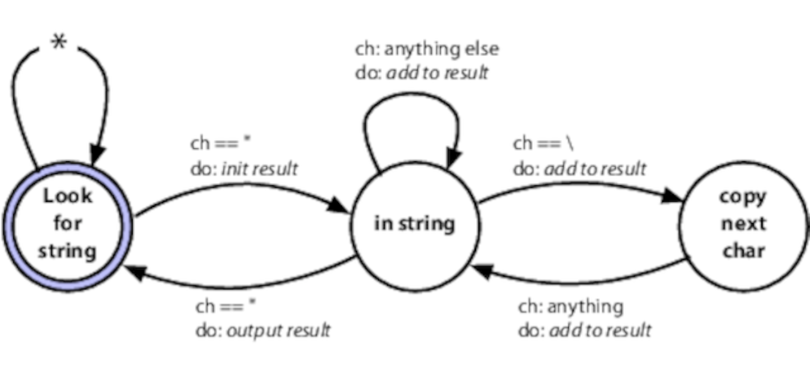
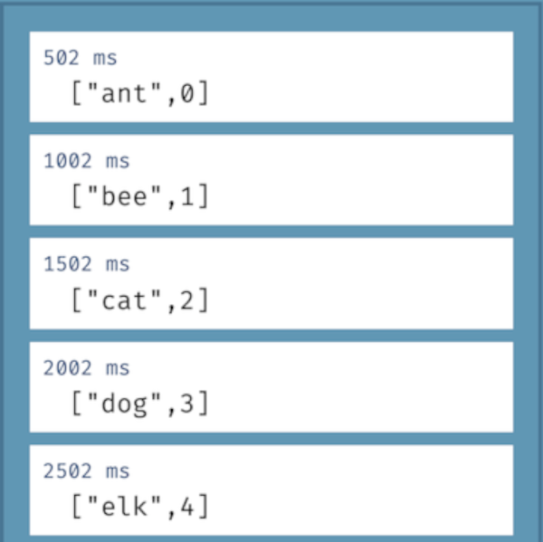
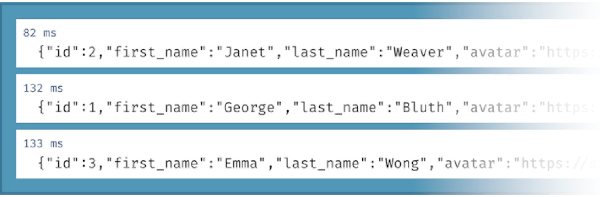

# 杂耍现实世界
<!-- 2020.04.05 -->
> _事情不会随随便便发生;_
> _它们是注定要发生的_
>
> _-- 约翰·F·肯尼迪_

在过去，当你的作者仍然有他们男孩般的美貌时，计算机不是特别灵活。我们通常会根据它们的局限性来组织与它们的交互方式。

今天，我们期待更多:计算机必须融入我们的世界，而不是相反。我们的世界是混乱的:事情不断地发生，东西四处移动，我们改变了我们的想法，……我们所写的应用程序必须知道怎么做。

本节主要讨论如何编写这些响应型应用程序。

我们将从事件的概念开始。

## 事件
事件就是信息的可用性。它可能来自外部世界：用户单击按钮，或股票报价更新。它可能是内部的：计算结果就绪，搜索完成。它甚至可以像获取列表中的下一个元素那样微不足道。

无论事件源是什么，如果我们编写响应事件的应用程序，并根据这些事件调整它们的工作方式，那么这些应用程序将在现实世界中更好地工作。他们的用户会发现他们更具交互性，应用程序本身也会更好地利用资源。

但是我们如何编写这些类型的应用程序呢？如果没有某种策略，我们很快就会发现自己很困惑，我们的应用程序将是一堆紧密耦合的代码。

让我们看看有帮助的四个策略。

- 有限状态机
- 观察者模式
- 发布/订阅
- 反应式编程和流

## 有限状态机
戴夫发现他几乎每周都用有限状态机（FSM）编写代码。通常，FSM 实现只需要几行代码，但这几行代码有助于解决很多潜在的问题。

使用 FSM 非常简单，但是许多开发人员都回避使用它。似乎有一种观点认为它们是困难的，或者它们只在您使用硬件时才适用，或者您需要使用一些难以理解的库。这些都不是真的。

### 实用 FSM 的剖析

状态机基本上只是一个如何处理事件的规范。它由一组状态组成，其中一个是当前状态。对于每个状态，我们列出对该状态重要的事件。对于每个事件，我们定义系统的当前新的状态。

例如，我们可能正在从 websocket 接收很多消息。第一条消息是头。随后是任意数量的数据消息。最后我们会收到一条结束的消息。

这可以表示为如下的 FSM ：


我们从“初始状态”开始。如果我们接收到头消息，我们就转换到“读取消息”状态。如果我们在初始状态（标记为星号的行）时接收到任何其他信息，我们就转换到“错误”状态，就完成了。

当我们处于“读取消息”状态时，我们可以接受数据消息，在这种情况下，我们可以继续以相同的状态读取，也可以接受尾部消息，它将我们转换到“完成”状态。任何其他操作都会导致转换到错误状态。

FSMs的精妙之处在于，我们可以将它们纯粹地表示为数据。下面是一个表，表示我们的消息解析器：

<table style="text-align: center; width: 100%;" border="1">
  <tr>
    <td rowspan="2">State</td>
    <td colspan="4">Events</td>
  </tr>
  <tr>
    <td>Header</td>
    <td>Data</td>
    <td>Trailer</td>
    <td>Other</td>
  </tr>
  <tr>
    <td>Initial</td>
    <td>Reading</td>
    <td>Error</td>
    <td>Error</td>
    <td>Error</td>
  </tr>
  <tr>
    <td>Reading</td>
    <td>Error</td>
    <td>Reading</td>
    <td>Done</td>
    <td>Error</td>
  </tr>
</table>

表中的行表示状态。若要了解事件发生时要执行的操作，请在行中查找当前状态，并沿行扫描表示该事件的列，该单元格的内容是新状态。

处理它的代码同样简单：

```ruby
TRANSITIONS = {
  initial: {header: :reading},
  reading: {data: :reading, trailer: :done}
}

state = :initial

while state != :done && state != :error
  msg = get_next_msg()
  state = TRANSITIONS[state][msg.msg_type] || :error
end
```

在第 10 行实现状态之间转换的代码。它使用当前状态索引转换表，然后使用消息类型索引该状态的转换。如果没有匹配的新状态，则将状态设置为 _:error_

### 添加操作
一个纯粹的 FSM，就像我们刚才看到的，基本上是一个解析器，将传入的事件与状态转换相匹配。它的唯一输出是最终状态。我们可以通过添加在某些转换上触发的操作来增强它。

例如，我们可能需要提取源文件中的所有字符串。字符串是引号之间的文本，但字符串中的反斜杠将转义下一个字符，因此 "Ignore\"quotes"" 是单个字符串。这里有一个 FSM 可以做到这一点：



这次，每个转换都有两个标签。上一个是触发它的事件，下一个是我们在不同状态之间移动时要采取的操作。
我们会用一张表格来表达，就像上次一样。但是，在这种情况下，表中的每个条目都是一个包含下一个状态和操作名称的双元素列表。

```ruby
TRANSITIONS = {
  # current new state action to take
  # --------------------------------
  look_for_string: {
    '"' => [:in_string, :start_new_string],
    :default => [:look_for_string, :ignore],
  },

  in_string: {
    '"' => [:look_for_string, :finish_current_string],
    '\\' => [:copy_next_char, :add_current_to_string],
    :default => [:in_string, :add_current_to_string],
  },

  copy_next_char: {
    :default => [:in_string, :add_current_to_string],
  },
}
```

我们还添加了指定默认转换的功能，如果事件与此状态的任何其他转换都不匹配，则执行该转换。
现在让我们看看代码：

```ruby
state = :look_for_string
result = []
while ch = STDIN.getc
  state, action = TRANSITIONS[state][ch] || TRANSITIONS[state][:default]
  case action
    when :ignore
    when :start_new_string
        result = []
    when :add_current_to_string
        result << ch
    when :finish_current_string
        puts result.join
  end
end
```

这与前面的示例类似，因为我们循环事件（输入中的字符），触发转换。但它比以前的代码做得更多。每次转换的结果都是一个新状态和一个操作的名称。在返回循环之前，我们使用操作名来选择要运行的代码。

这段代码非常基本，但它完成了任务。还有许多其他变体：转换表可以对操作使用匿名函数或函数指针，可以将实现状态机的代码包装在单独的类中，并使用其自己的状态，等等。

不用说你必须同时处理所有的状态转换。如果你要在你的应用上注册一个用户，当他们输入他们的详细信息，验证他们的电子邮件，同意在线应用现在必须发出的 107 个不同的法律警告时，可能会有一些过渡，等等。将状态保存在外部存储中，并使用它来驱动状态机，是处理此类工作流需求的一种好方法。

### 状态机是一个开始
开发人员对状态机的使用不足，我们鼓励您寻找应用它们的机会。但它们并不能解决所有与事件相关的问题。所以让我们来看看其他一些处理事件的方法。

## 观察者模式
在 _观察者模式_ 中，我们有一个称为可观察事件的事件源，一个观察者列表，对这些事件感兴趣。

观察者向可观察对象注册其兴趣，通常是通过传递对要调用的函数的引用。随后，当事件发生时，observate 遍历它的观察者列表，并调用每个观察者传递它的函数。事件作为该调用的参数给定。

这里有一个简单的 Ruby 示例。终止器 模块用于终止应用程序。但是，在执行此操作之前，它会通知所有观察者应用程序将退出。他们可能会使用此通知来整理临时资源、提交数据等。

```ruby
module Terminator
  CALLBACKS = []

  def self.register(callback)
    CALLBACKS << callback
  end

  def   self.exit(exit_status)
    CALLBACKS.each {
      |callback| callback.(exit_status)
      exit!(exit_status)
    }
  end
end
```

```shell
Terminator.register(-> (status) { puts "callback 1 sees #{status}"})
Terminator.register(-> (status) { puts "callback 2 sees #{status}"})

Terminator.exit(99)
$ ruby event/observer.rb
callback 1 sees 99
callback 2 sees 99
```

创建一个observate并不需要太多代码：您将一个函数引用推送到一个列表上，然后在事件发生时调用这些函数。这是不使用库的一个很好的例子。

观察者/可观测模式已经使用了几十年，它对我们很有帮助。它在用户界面系统中特别流行，在这些系统中，回调用于通知应用程序发生了一些交互。

但是观察者模式有一个问题：因为每个观察者都必须向被观察者注册，所以它引入了耦合。此外，因为在典型的实现中，回调是由可观察的、同步的内联处理的，所以它会引入性能瓶颈。

下一个策略 发布/订阅 解决了这个问题。

## 发布/订阅
发布/订阅（pubsub）扩展了观察者模式，同时解决了耦合和性能问题。

在 pubsub 模型中，我们有发布者和订阅者。这些是通过 channel 连接的。channel 在单独的代码体中实现：有时是库，有时是进程，有时是分布式基础设施。所有这些实现细节都隐藏在代码中。

每个 channel 都有名字。订阅者在一个或多个命名 channel 中注册兴趣，发布者向其写入事件。与观察者模式不同，发布者和订阅者之间的通信是在代码外部处理的，并且可能是异步的。

尽管您可以自己实现一个非常基本的 pubsub 系统，但您可能不想这样做。大多数云服务都提供了 pubsub 服务，允许您连接世界各地的应用程序。每种流行语言都至少有一个 pubsub 库。

Pubsub 是一种很好的分离异步事件处理的技术。它允许在应用程序运行时添加和替换代码，而无需更改现有代码。缺点是，在大量使用 pubsub 的系统中很难看到发生了什么：您不能查看发布者，也不能立即看到哪些订阅者与特定消息有关。

与观察者模式相比，pubsub 是一个通过共享接口（通道）进行抽象来减少耦合的好例子。然而，它基本上仍然只是一个消息传递系统。创建对事件组合做出响应的系统需要的不仅仅是这些，所以让我们来看看如何将时间维度添加到事件处理中。

## 反应式编程、流和事件
如果您曾经使用过电子表格，那么您将熟悉反应式编程。如果单元格包含引用第二个单元格的公式，则更新该第二个单元格也会导致第一个单元格更新。这些值随着它们使用的值的变化而变化。

有许多框架可以帮助实现这种数据级的反应性：在浏览器领域，React 和 Vue.js 是当前最受欢迎的（但是，这是JavaScript，在这本书出版之前，这些信息就已经过时了）。

很明显，事件也可以用来触发代码中的反应，但不一定容易查明它们。那是流流入的地方。

流允许我们将事件视为数据的集合。好像我们有一个活动列表，当新的活动到来时，列表会变长。它的美妙之处在于，我们可以像对待任何其他集合一样对待流：我们可以操作、组合、过滤和执行我们非常熟悉的所有其他数据相关的事情。我们甚至可以组合事件流和常规集合。流可以是异步的，这意味着您的代码有机会在事件到达时响应它们。

反应性事件处理的当前事实基线在网站 http://reactivex.io 上定义，该网站定义了一组与语言无关的原则，并记录了一些常见的实现。这里我们将使用 JavaScript  的 RxJs 库

我们的第一个示例采用两个流并将它们压缩在一起：结果是一个新流，其中每个元素包含第一个 inout 流中的一个项和另一个 inout 流中的一个项。在本例中，第一个流只是5个动物名称的列表。第二个流更有趣：它是一个间隔计时器，每 500 毫秒生成一个事件。因为流是压缩在一起的，所以只有当两个流上都有可用的数据时才会生成一个结果，因此我们的结果流每半秒只发出一个值。

```js
import * as Observable from 'rxjs'
import { logValues } from './logger.js'
let animals = Observable.of("ant", "bee", "cat", "dog", "elk")
let tiker = Obverable.interval(500)
let combined = Observable.zip(animals, ticker)
combined.subscribe(next => logValues(JSON.stringify(next)))
```

这段代码使用了一个简单的日志记录函数，它将项目添加到浏览器窗口的列表中。每个项目都用程序开始运行后的时间（毫秒）作为时间戳。下面是我们的代码得到的：



注意时间戳：我们每500毫秒从流中获取一个事件。每个事件包含一个序列号（由可观察到的 间隔 创建）和列表中下一个动物的名称。看着它在浏览器中运行，日志行每半秒出现一次。

事件流通常在事件发生时填充，这意味着填充它们的可观测数据可以并行运行。下面是一个从远程站点获取用户信息的示例。为此，我们将使用 https://reqres.in ，这是一个提供开放 REST 接口的公共站点。作为其 API 的一部分，我们可以通过对 users/«id» 执行 GET 请求来获取特定（假的）用户的数据。我们的代码获取 ID 为 3、2 和 1 的用户。

```js
import * as Observable from 'rxjs'
import { mergeMap } from 'rxjs/operators'
import { ajax } from 'rxjs/ajax'
import { logValues } from './logger.js'
let users = Observable.of(3, 2, 1)
let result = users.pipe(
    mergeMap((user) => ajax.getJSON(`https://reqres.in/api/users/${user}`))
)
result.subscribe(
  resp => logValues(JSON.stringify(resp.data)),
  err => console.error(JSON.stringify(err))
)
```

代码的内部细节并不太重要。令人兴奋的是结果：



看看时间戳：这三个请求，或者说是三个独立的流，是并行处理的，第一个返回，对于 id 2，需要 82ms，接下来的两个返回 50 和 51ms。

### 事件流是异步集合
在前面的例子中，我们的用户 ID 列表（在可观察的 用户 中）是静态的。但这不一定。也许我们想在人们登录我们的网站时收集这些信息。我们所要做的就是在创建会话时生成一个包含用户 id 的可观察事件，并使用该可观察事件而不是静态事件。然后，我们会在收到这些 id 时获取用户的详细信息，并可能将它们存储在某个地方。

这是一个非常强大的抽象概念：我们不再需要把时间看作是我们必须管理的东西。事件流将同步和异步处理统一在一个通用、方便的 API 后面。

## 事件无处不在
事件无处不在。有些是显而易见的：一个按钮点击，一个计时器过期。另一些则不那么重要：有人登录，文件中的一行与模式匹配。但无论它们的源代码是什么，围绕事件精心编制的代码都可以比其线性对应的代码更具响应性和更好的解耦。

## 相关内容包括

- 话题 28 [_解耦_](./解耦.md)
- 话题 36 [_黑板_](../Chapter6/黑板.md)

## 练习

### 练习 17（尽可能回答）
在 FSM 部分中，我们提到可以将通用状态机实现移动到它自己的类中。该类可能通过传入转换表和初始状态来初始化。
尝试以这种方式实现字符串提取器。

### 练习 18（尽可能回答）
这些技术中哪一种（可能是组合使用的）最适合以下情况：

- 如果您在五分钟内收到三个网络接口关闭事件，请通知操作人员。
- 如果是日落后，在楼梯底部检测到运动，然后在楼梯顶部检测到运动，请打开楼上的灯。
- 您要通知各种报告系统订单已完成。
- 为了确定客户是否有资格获得汽车贷款，应用程序需要向三个后端服务发送请求并等待响应。
