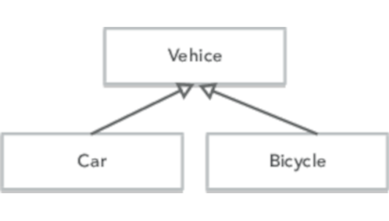
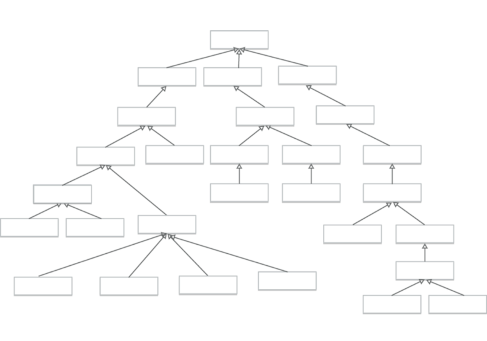

# 继承税
<!-- 2020.04.07 -->

> _你想要一个香蕉，但你得到的是一只大猩猩拿着香蕉和整个丛林。_
>
> _-- 乔 阿姆斯特朗_

你使用面向对象语言编程吗？你使用继承吗？

如果是，请停下来。这很可能并不是你想要做的。

让我们来看看为什么。

## 一些背景
继承最早出现在 1969 年的 模拟语言 Simula67中。这是解决在同一个列表上对多种类型的事件进行排队的问题的一个很好的解决方案。Simula方法是使用前缀类。你可以这样写：

    link CLASS car;
      ... implementation of car
    link CLASS bicycle;
      ... implementation of bicycle

然后你可以把汽车和自行车都加到在红绿灯处等着的东西的列表里。在当前的术语中，link 将是父类。

Simula 程序员使用的思想模型是，在实现类 car 和 bicycle 之前，预先准备好实例数据和类 link 的实现。link 部分几乎被视为一个集装箱，用来运载汽车和自行车。这给了他们一种多态性：汽车和自行车都实现了 link 接口，因为它们都包含 link 代码。

Simula 之后是 Smalltalk。Smalltalk 的创始人之一艾伦•凯（Alan Kay）在 2019 年的一份 Quora 答卷中描述了Smalltalk 拥有继承的原因。

    因此，当我设计 Smalltalk-72 时，想到 Smalltalk-71 时，我觉得用它类似 Lisp 的动力学来做“差分编程”的实验是很有趣的（意思是：用各种方法来实现“除了这一点以外，这就是它”）。

这是纯粹为了行为的子类化。

这两种继承方式（实际上有相当数量的共同点）在接下来的几十年里发展起来。Simula方法，它建议继承是一种组合类型的方法，在 C++ 和 java 语言中继续使用。Smalltalk 学派是一个动态的行为组织，它出现在 Ruby 和 JavaScript 等语言中。

因此，现在我们面对的是一代使用继承的面向对象开发人员，原因有二：

- 他们不喜欢打字
- 他们喜欢类型

那些不喜欢键入的人可以通过使用继承将基类中的公共功能添加到子类中来节省开支：类 User 和类 Product 都是ActiveRecord::Base 的子类。

喜欢类型的人使用继承来表示类之间的关系：Car 是一种 Vehicle。

不幸的是，这两种继承都有问题。

## 使用继承共享代码的问题
继承是耦合的。子类不仅耦合到父类、父类的父类等；而且使用子类的代码也耦合到所有祖先。

```ruby
class Vehicle
  def initialize
    @speed = 0
  end

  def stop
    @speed = 0
  end

  def mova_at(speed)
    @speed = speed
  end
end
class Car < Vehicle
  def info
    "I'm car driving at #{@speed}"
  end
end

# top-level code
my_car = Car.new
mycar.move_at(30)
```

当顶级调用 my_car.move_at 时，调用的方法是在 Car 的父级 Vehicle 中。

现在负责 Vehicle 的开发人员更改了 API，所以 move_at 变成了 set_velocity，实例变量 @speed 变成了@velocity。

预计 API 更改将中断类 Vehicle 的客户端。但最高层并不是：就它而言，它使用的是 Car。Car 类在实现方面所做的并不是顶层代码所关心的，但它仍然会中断。

类似地，实例变量的名称纯粹是一个内部实现细节，但是当 Vehicle 改变时，它也（无声地）中断 Car。

如此多的耦合。

### 使用继承生成类型的问题
有些人认为继承是定义新类型的一种方式。他们最喜欢的设计图显示了类层次结构。他们像维多利亚时代的绅士科学家看待自然的方式看待问题，把问题分成不同的类别。



不幸的是，这些图表很快就会变成覆盖着墙壁的怪物，一层一层地添加，以表达类之间最小的差别。这种增加的复杂性会使应用程序更加脆弱，因为更改会在许多层上下波动。



不过，更糟糕的是多重继承问题。Car 可以是一种 Vehicle，但也可以是一种 Asset, InsuredItem, LoadCollateral 等。正确建模需要多重继承。

20世纪90年代，由于存在一些歧义消除的语义，C++赋予了多重继承一个坏名字。因此，许多当前的OO语言都不提供它。所以，即使你对复杂类型的树很满意，你也不能准确地建模你的域。

---
## 提示 51 不要付继承税
---

## 其他选择更好
让我们建议三种技术，这意味着您不应该再使用继承：

- 接口和协议
- 委托
- 混合与特征

### 接口和协议
大多数OO语言允许您指定一个类实现一组或多组行为。例如，可以说 Car 类实现了 Drivable 行为和 Locatable 行为。用于执行此操作的语法各不相同：在 Java 中，可能如下所示：

```java
public class Car implements Drivable, Locatable {
  // ...
}
```

Drivable 和 Locatable 在 Java 里称为接口；其他语言称它们为协议，有些称它们为 trait（尽管这不是我们稍后将要调用的trait）。

接口的定义如下：

```java
public interface Drivable() {
  double getSpeed();
  void stop();
}

public interface Locatable() {
  Coordinate getLocation();
  boolean locationIsValid();
}
```

这些声明不创建代码：它们只是说，实现 Drivable 的任何类都必须实现 getSpeed 和 stop 两个方法，而 Locatable 的类必须实现 getLocation 和 locationIsValid。这意味着，我们以前的 Car 类定义只有包含所有这四个方法时才有效。

接口和协议之所以如此强大，是因为我们可以将它们用作类型，而实现适当接口的任何类都将与该类型兼容。如果Car 和 Phone 都实现 Locatable ，我们可以将它们存储在可定位项目列表中：

```java
List<Locatable> items = new ArrayList<>();
items.add(new Car(...));
items.add(new Phone(...));
items.add(new Car(...));
// ...
```

然后我们可以安全地处理该列表，因为我们知道每个项目都有 getLocation 和 locationIsValid。

```java
void printLocation(Locatable item) {
  if (item.locationIsValid) {
    print(item.getLocation().asString());
  }

  // ...

  items.forEach(printLocation)
}
```

---
## 提示 52 更喜欢接口来表示多态性
---

接口和协议给了我们无继承性的多态性。

### 委托
继承鼓励开发人员创建对象具有大量方法的类。如果一个父类有20个方法，而子类只想使用其中的两个，那么它的对象仍然会有另外18个方法，而这些方法是可以调用的。类已失去对其接口的控制。这是一个常见的问题：许多持久性和UI框架都坚持要求应用程序组件子类化某些提供的基类：

```ruby
class Account < PersitenceBaseClass
end
```

Account类现在携带了持久性类的所有API。相反，设想一种使用委托的替代方法：

```ruby
class Account
  def initialize(...)
    @repo = Persister.for(self)
  end
  def save
    @repo.save()
  end
end
```

我们现在不向 Account 类的客户端公开任何框架API：这种分离现在已经被打破。但还有更多。现在我们不再受我们使用的框架的 API 的约束，我们可以自由地创建我们需要的 API。是的，我们以前可以这样做，但是我们总是冒着这样的风险：我们编写的接口可能被绕过，而持久性 API 则被使用。现在我们控制一切。

---
## 提示 53 委托给服务：Has-A 胜过 Is-A
---

事实上，我们可以更进一步。为什么一个 Account 必须知道如何保存自己？它的工作不是了解并执行帐户业务规则吗？

```ruby
class Account
  # nothing but account stuff
end

class AccountRecord
  # wraps an account with the ability
  # to be fetched and stored
end
```

现在我们真的解耦了，但这是要付出代价的。我们必须编写更多的代码，其中一些代码通常是样板文件：例如，很可能我们所有的记录类都需要 find 方法。

幸运的是，这就是 mixins 和 traits 对我们的作用。

### 混合，特征，类别，协议扩展…
作为一个行业，我们喜欢给事物命名。我们常常给同一件事起许多名字。越多越好，对吧？

这就是我们在看混合时要处理的问题。基本思想很简单：我们希望能够使用新功能扩展类和对象，而不使用继承。所以我们创建了一组这些函数，给它们命名，然后用它们扩展一个类或对象。在这一点上，您已经创建了一个新的类或对象，该类或对象结合了原始类及其所有混合的功能。在大多数情况下，即使您无法访问要扩展的类的源代码，也可以进行此扩展。

现在，这个特性的实现和名称因语言而异。我们倾向于在这里称它们为 mixins，但我们真的希望您将其视为语言不可知的特性。我们将集中讨论所有这些实现所具有的功能：将现有功能与新功能合并。

作为一个例子，让我们回到我们的 AccountRecord 例子。之前，AccountRecord 需要同时了解帐户以及我们保存它的框架。它还需要将持久层中的所有方法委托给外部世界。

混合给了我们另一种选择。首先，我们可以编写一个 mixin 来实现（例如）三个标准 finder 方法中的两个。然后我们可以将它们作为 mixin 添加到 AccountRecord 中。而且，当我们为持久化的东西编写新类时，我们也可以向它们添加 mixin。

```ruby
mixin CommonFinders {
    def find(id) { ... }
  def findAll() { ... }
}

class AccountRecord extends BasicRecord with CommonFinders
class OrderRecord extends BasicRecord with CommonFinders
```

我们可以更进一步。例如，我们都知道我们的业务对象需要验证代码来防止坏数据渗透到我们的计算中。但我们所说的 验证 到底是什么意思？

例如，如果我们拿到一个账户，可能有许多不同的验证层可以应用：

- 验证哈希密码是否与用户输入的密码匹配
- 创建帐户时验证用户输入的表单数据
- 正在验证更新用户详细信息的管理员输入的表单数据
- 正在验证其他系统组件添加到帐户的数据
- 在数据被持久化之前验证其一致性

一种常见的（我们认为不太理想的）方法是将所有验证捆绑到一个类（业务对象/持久性对象）中，然后添加标志来控制在哪种情况下触发。

我们认为更好的方法是使用 mixin 为适当的情况创建专门的类：

```ruby
class AccountForCustomer extend Account
  with AccountValidations, AccountCustomerValidations

class AccountForAdmin extend Account
  with AccountValidations, AccountAdminValidations
```

在这里，两个派生类都包含对所有帐户对象通用的验证。客户变型还包括适合面向客户的 api 的验证，而管理员变型包含（可能限制较少的）管理验证。

现在，通过来回传递 AccountForCustomer 或 AccountForAdmin 的实例，我们的代码自动确保应用了正确的验证。

---
## 技巧 54 使用 Mixins 共享功能
---

## 继承很少是答案
我们快速了解了传统类继承的三种替代方法：

- 接口和协议
- 委托
- 混合与特征

根据您的目标是共享类型信息、添加功能还是共享方法，这些方法在不同的情况下可能更适合您。与编程中的任何事情一样，目标是使用最能表达您意图的技术。

尽量不要把整个丛林都拖过去。

## 相关内容包括

- 话题 28 [_解耦_](./解耦.md)
- 话题 8  [_好设计的本质_](../Chapter2/好设计的本质.md)
- 话题 10 [_正交性_](../Chapter2/正交性.md)

## 挑战
- 下一次你发现自己是子类化的时候，花点时间检查一下选项。你能用接口、委托或混合实现你想要的吗？你这样做能减少耦合吗？
