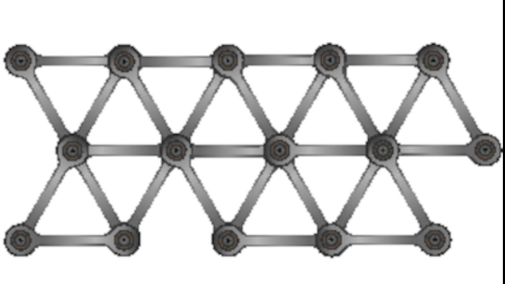
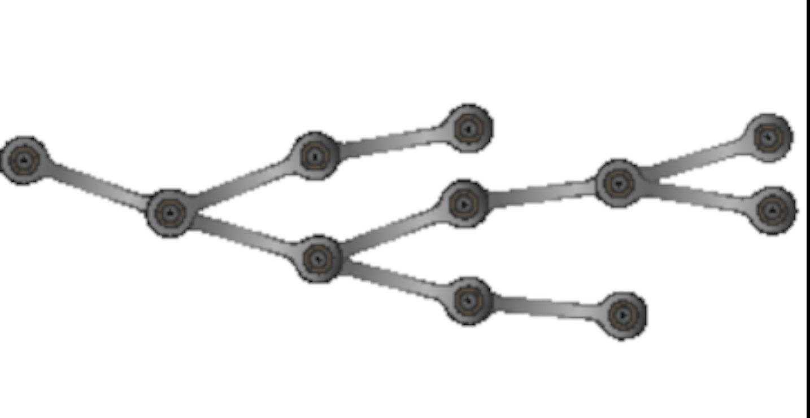

# 解耦
<!-- 2020.04.04 -->

> _当我们试图自己挑选东西的时候，我们发现它与宇宙中的其他一切联系在一起。_
>
> _-- 约翰·缪尔，《我在塞拉的第一个夏天》_

在话题 8 中，[_好设计的本质_](../Chapter2/好设计的本质.md) 我们主张使用良好的设计原则将使您编写的代码易于更改。 耦合是变化的敌人，因为它将必须并行变化的事物链接在一起。 这使更改变得更加困难：要么花时间跟踪所有需要更改的部分，要么花时间思考为什么当您更改“仅一件事”而不是与之关联的其他事情时事情就破裂了。

当您要设计刚性的东西时，也许是桥或塔，就需要将组件耦合在一起。



您不能更改任何单个链接的长度而不影响其他链接：这就是使结构僵化的原因。

将此与以下内容进行比较：



这里没有结构上的僵化：单个链接可以更改，而其他链接可以容纳它。

在设计桥梁时，您希望它们保持其形状。 您需要他们变得僵硬。 但是，当您设计要更改的软件时，您恰恰相反：您希望它具有灵活性。 并且为了灵活起见，应将各个组件耦合到尽可能少的其他组件。

更糟糕的是，耦合是传递的：如果 A 跟 B 和 C 耦合 ，B 跟 M 和 N 耦合，C 跟 X 和 Y 耦合，那么 A 实际上跟 B、C、M、N、X 和 Y 都耦合。

这意味着你应该遵循一个简单的原则：

---
## 技巧 44 解耦的代码更容易更改
---

考虑到我们通常不使用钢梁和铆钉进行编码，那么编码解耦意味着什么呢？在本节中，我们将讨论：

- 火车残骸 - 方法调用链

- 全局化 - 静态事物的危险

- 继承 - 为什么子类化是危险的

在某种程度上，这个列表是人为的：耦合可能发生在两段代码共享某个东西的任何时候，因此当您阅读下面的内容时，请注意底层模式，以便将它们应用到您的代码中。注意一些耦合的症状：

- 不相关模块或库之间古怪的依赖关系。

- 对一个模块来说，“简单”的更改是指：

  - 通过系统中不相关的模块传播；

  - 或者在系统的其他地方打破东西。系统中不相关的模块。

- 那些不敢更改代码的开发人员主要是因为他们不确定会受到什么影响。

- 每个人都必须参加会议，因为没有人确定谁会受到变化的影响。

## 火车残骸

我们都见过（可能也写过）这样的代码：

```java
public void applyDiscount(customer, order_id, discount) {
  totals = customer
              .orders
              .find(order_id)
              .getTotals;

  totals.grandTotdal = totals.grandTotal - discount;
  totals.discount = discount;
}
```

我们从一个 customer 对象中获取到一些订单的引用，使用它来查找一个特定的订单，然后获取订单的总价格。使用这些总价格，我们从订单总价格减去折扣，并用该折扣更新它们。

这段代码跨越了五个抽象层次，从客户到总量。最终，我们的顶层代码必须知道，customer 对象公开了 orders，orders 有一个 find 方法，该方法接受一个 order id 并返回一个 order，order 对象有一个 totals 对象，totals 对象有一个 getter 和 setter，用于汇总和折扣。这是很多隐性知识。但更糟糕的是，如果这段代码要继续工作，很多事情在未来是无法改变的。在一列火车里的所有的车都是我们耦合在一起的，就像在一列失事的火车里的所有的方法和属性一样。

让我们想象一下，企业认为任何订单的折扣都不能超过 40%。我们将把执行这一规则的代码放在哪里？

你可能会说它属于我们刚刚编写的 applyDiscount 函数。这当然是答案的一部分。但是现在的代码，你不知道这就是全部的答案。任何一段代码，任何地方，都可以在 totals 对象中设置字段，如果代码的维护者没有得到备忘录，它就不会检查新策略。

看待这一点的一种方法是考虑责任。totals 对象似乎应该负责管理总价格。但事实并非如此：它实际上只是一个容器，可供任何人查询和更新一堆字段。

解决方法是应用我们称之为：

---
## 提示 45 说明，不要问
---

这个原则说，你不应该根据一个对象的内部状态来做决定，然后再更新这个对象。这样做会完全破坏封装的好处，并在代码中传播实现的知识。

因此，我们火车失事的第一个解决方案是将折扣委托给总价格：

```java
public void applyDiscount(customer, order_id, discount) {
  customer
    .orders
    .find(order_id)
    .getTotals()
    .applyDiscount(discount);
}
```

我们对 customer 对象及其订单也有同样的 tell-don't-ask（TDA）问题：我们不应该获取它的订单列表并搜索它们。我们应该直接从顾客那里得到我们想要的订单。

```java
public void applyDiscount(customer, order_id, discount) {
  customer
    .orders
    .findOrder(order_id)
    .getTotals()
    .applyDiscount(discount);
}
```

同样的事情也适用于我们的 order 对象及其总数。为什么外部世界必须知道订单的实现使用一个单独的对象来存储其总数？

```java
public void applyDiscount(customer, order_id, discount) {
  customer
    .findOrder(order_id)
    .applyDiscount(discount);
}
```

到这里我们可能就停下来了。

此时，您可能认为 TDA 将使我们向 customers 添加一个 applyDiscountToOrder(order_id) 方法。而且，如果被奴性地跟踪，它会的。

但 TDA 不是自然规律，它只是帮助我们认识问题的一种模式。在这种情况下，我们很容易暴露这样一个事实：customers 有 orders，我们可以通过询问 customer 对象来找到其中一个 order 。这是一个务实的决定。

在每个应用程序中都有一些通用的顶级概念。在这个应用程序中，这些概念包括 customer 和 order。完全将 order 隐藏在 customer 对象中是没有意义的：它们有自己的存在。因此，我们可以创建公开 order 对象的 api。

## 迪米特法则

人们经常谈论有关耦合的称为德米特法则（LoD）的东西。LoD 是由 Ian Holland 在80年代末编写的一套指南。他创建它们是为了帮助 Demeter 项目的开发人员保持其功能的干净和分离。

LoD 表示，在类 C 中定义的方法只应调用：

- C语言中的其他实例方法

- 它的参数

- 在堆栈和堆中创建的对象中的方法

- 全局变量

在这本书的第一版中，我们花了一些时间来描述 LoD。在这中间的 20 年里，那朵玫瑰的花期已经褪去了。我们现在不喜欢“global variable”子句（原因我们将在下一节讨论）。我们还发现在实践中很难使用它：这有点像在调用方法时必须解析法律文档。

然而，这一原则仍然是正确的。我们只是建议用一种更简单的方式来表达几乎相同的东西：

---
## 提示 46 不链式调用方法
---

当你访问某物时，尽量不要有多个“.”。访问还包括使用中间变量的情况，如下代码所示：

```java
# This is pretty poor style

amount = customer.orders.last().totals().amount

# and so is this

orders = customer.orders;
last = orders.last();
totals = last.totals();
amount = totals.amount();
```

一个 “.” 法则有一个很大的例外：如果你链接的东西真的，真的不太可能改变，那么这个法则就不适用。实际上，应用程序中的任何内容都应该被视为可能发生更改。第三方库中的任何内容都应该被视为不稳定的，特别是当已知第三方库的维护者在不同版本之间更改 api 时。不过，该语言附带的库可能非常稳定，因此我们很乐意使用以下代码：

```java
people
.sort_by {| person | person.age}
.first(10)
.map(| person | person.name)
```

20 年前，当我们编写第一版的时候，Ruby 代码就已经工作了，而且当我们进入老程序员的家（现在的任何一天…）的时候，Ruby 代码仍然可能工作。

## 链式和管道

在话题 30 [_转换编程_](./转换编程.md) 中，我们讨论如何将函数组合为管道。这些管道转换数据，将数据从一个函数传递到下一个函数。这与方法调用的火车残骸不同，因为我们不依赖隐藏的实现细节。

这并不是说管道不引入耦合：它们引入耦合。管道中一个函数返回的数据格式必须与下一个函数接受的格式兼
容。

我们的经验是，这种形式的耦合远不是改变由火车引入的形式破坏的代码的障碍。

## 全局化的罪恶

全局可访问的数据是应用程序组件之间耦合的潜在来源。每一条全局数据的作用就好像应用程序中的每一个方法突然获得了一个额外的参数：毕竟，每个方法中都有全局数据可用。

Globals 耦合代码有很多原因。最明显的是，对全局实现的更改可能会影响系统中的所有代码。当然，在实践中，影响是相当有限的；问题的关键在于知道你已经找到了每一个需要改变的地方。

当涉及到将代码分开时，全局数据也会创建耦合。

代码重用的好处已经做了很多工作。我们的经验是，在创建代码时，重用可能不应该是主要的关注点，但是使代码可重用的思想应该是编码例程的一部分。当您使代码可重用时，您将为它提供干净的接口，使其与其他代码分离。这允许您提取一个方法或模块，而不必拖拽其他任何东西。如果您的代码使用全局数据，则很难将其与其他代码分离。

当您为使用全局数据的代码编写单元测试时，就会出现这样的例子。您将发现自己正在连接一堆设置代码，以创建一个全局环境，从而允许您的测试运行。

---
## 避免全局数据
---

### 全局数据包括单例

在前一节中，我们仔细讨论了全局数据，而不是全局变量。那是因为人们经常告诉我们“看！没有全局变量。我将其全部打包为一个单例对象或全局模块中的实例数据。”

再试一次，Skippy。如果您只有一个带有一堆导出实例变量的单例，那么它仍然只是全局数据。它只是有一个更长的名字。

所以人们就用这个单例将数据隐藏在方法后面。他们现在说的是 Config.log_level() 或 Config.getLogLevel()，而不是对 Config.log_level 进行编码。

这更好，因为这意味着你的全局数据背后有一点智能。如果决定更改日志级别的表示形式，可以通过在 API 中配置映射新的和旧的来保持兼容性。但您仍然只有一组配置数据。

### 全局数据包括外部资源

任何可变的外部资源都是全局数据。如果您的应用程序使用数据库、数据存储、文件系统、服务 API 等，则有落入全局陷阱的风险。同样，解决方案是确保始终将这些资源包装在您控制的代码后面。

---
## 提示 48 如果它足够重要，可以是全局的，就用一个 API 包起来
---

（但前提是你真的，真的希望它是全局性的）

## 继承增加耦合

当一个类从另一个类继承状态和行为时，滥用子类是如此重要，以至于我们在它自己的章节，主题 31，继承税 中讨论了它。

## 再说一次，一切都是为了改变

耦合代码很难更改：在一个地方的更改可能会对代码中的其他地方产生副作用，并且通常会在一个月后才在生产中曝光的难以找到的地方产生副作用。

保持代码害羞：让它只处理它直接知道的事情，将有助于保持应用程序的解耦，这将使它们更易于更改。

## 相关内容包括

- 话题 32 [_配置_](./配置.md)
- 话题 9  [_重复的恶魔_](../Chapter2/重复的恶魔.md)
- 话题 8  [_好设计的本质_](../Chapter2/好设计的本质.md)
- 话题 31 [_继承税_](./继承税.md)
- 话题 10 [_正交性_](../Chapter/正交性.md)
- 话题 11 [_可逆性_](../Chapter/可逆性.md)
- 话题 33 [_断开时间耦合_](../Chapter6/断开时间耦合.md)
- 话题 29 [_杂耍现实世界_](./杂耍现实世界.md)
- 话题 34 [_共享状态不正确_](../Chapter6/共享状态不正确.md)
- 话题 35 [_Actors和进程_](../Chapter6/actors和进程.md)
- 话题 36 [_黑板_](../Chapter6/黑板.md)
- 话题 30 [_转换编程_](./转换编程.md)
- 我们在 2003 年的软件构建文章《嵌入的艺术》中讨论了讲述，不要问
