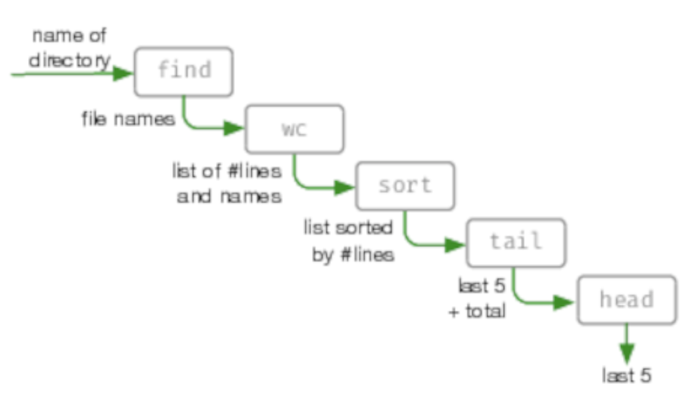

# 转换编程
<!-- 2020.04.06 -->

> _如果你不能把你正在做的事情描述成一个过程，你就不知道你在做什么。_
>
> _-- W. Edwards Deming, (attr)_

所有的程序都转换数据，将输入转换为输出。然而，当我们考虑设计时，很少考虑创建转换。相反，我们担心的是类和模块、数据结构和算法、语言和框架。

我们认为这种对代码的关注常常忽略了这一点：我们需要重新把程序看作是将输入转换为输出的东西。当我们这样做的时候，我们之前担心的许多细节就消失了。结构变得更加清晰，错误处理更加一致，耦合度下降。

为了开始我们的调查，让时间机器把我们把带回20世纪70年代，让一个 Unix 程序员为我们编写一个程序，列出目录树中最长的五个文件，这里最长意味着“拥有最多的行”。你可能希望他们找到一个编辑器，开始输入C语言，但他们不会，因为他们考虑的是我们拥有的（目录树）和我们想要的（文件列表）。然后他们会去一个终端输入如下内容：

```bash
find . -type f | xargs wc -l | sort -n | tail -5
```

这是一系列转换:

_find . -type f_

    将当前目录（.）中或其下的所有文件（-type f）的列表写入标准输出。

_xargs wc -l_

    从标准输入中读取行并将它们作为参数传递给命令 wc -l。带有 -l 选项的 wc 程序计算每个参数中的行数，并将每个结果作为“count filename”写入标准输出。

_sort -n_

    对标准输入排序，假设每行以数字（-n）开头，将结果写入标准输出。

_tail -5_

    读取标准输入并将最后 6 行写入标准输出。

在我们的图书目录中运行这个，我们得到

```bash
470 ./test_to_build.pml
487 ./dbc.pml
719 ./domain_languages.pml
727 ./dry.pml
9561 total
```

最后一行是所有文件（不仅仅是显示的文件）中的总行数，因为 wc 就是这样做的。我们可以从尾部再请求一行，然后忽略最后一行，从而将其剥离：

```bash
find . -type f | xargs wc -l | sort -n | tail -5 | head -5

470 ./test_to_build.pml
487 ./dbc.pml
719 ./domain_languages.pml
727 ./dry.pml
9561 total
```

让我们从各个步骤之间流动的数据来看：



我们最初的要求“按行排列的前5个文件”变成了一系列转换：

    目录名
    -> 文档列表
    -> 带行号的列表
    -> 排序列表
    -> 最高的五个 + 总数
    -> 最高的五个

它几乎就像一条工业装配线：一端输入原始数据，另一端输出成品（信息）。

我们喜欢这样思考所有的代码。

---
## 提示 49 编程是关于代码的，但程序是关于数据的
---

## 寻找转换
有时找到转换的最简单方法是从需求开始并确定其输入和输出。现在您已经定义了表示整个程序的函数。然后，您可以找到引导您从输入到输出的步骤。这是自上而下的方法。

例如，您希望为玩文字游戏的人创建一个网站，该网站将查找可以由一组字母组成的所有文字。这里输入的是一组字母，输出的是一个由3个字母单词、4个字母单词等组成的列表。

    "lvyin"      被转换为       ->       3 => ivy,lin,nil,yin
                                        4 => inly,liny,viny
                                        5 => vinyl

（是的，它们都是单词，至少根据macOS字典是这样的。）

整个应用程序背后的诀窍很简单：我们有一个字典，它通过一个签名对单词进行分组，这样所有包含相同字母的单词都将具有相同的签名。最简单的签名函数只是单词中字母的排序列表。然后，我们可以通过生成输入字符串的签名来查找该字符串，然后查看字典中哪些单词（如果有的话）具有相同的签名。

因此，anagram finder分解为四个独立的转换。

|Step|Transformation|Sample data|
|:--:|:--:|:--:|
|Step 0:|初始化输入|"ylvin"|
|Step 1:|三个或三个以上字母的所有组合|vin, viy, vil, vny, vnl, vyl, iny, inl, iyl, nyl, viny, vinl, viyl, vnyl, inyl, vinyl|
|Step 2:|组合签名|inv, ivy, ilv, nvy, lnv, lvy, iny, iln, ily, lny, invy, ilnv, ilvy, lnvy, ilny, ilnvy|
|Step 3:|与任何签名匹配的所有词典单词的列表|ivy, yin, nil, lin, viny, liny, inly, vinyl|
|Step 4:|按字符长度分组|3 => ivy, lin, nil, yin; 4 => inly, liny, viny; 5 => vinyl|

### 一直向下转换
让我们从看步骤1开始，它接受一个单词并创建一个包含三个或更多字母的所有组合的列表。此步骤本身可以表示为转换列表：

|Step|Transformation|Sample data|
|:--:|:--:|:--:|
|Step 1.0:|初始化输入|"vinyl"|
|Step 1.1:|转换成字符|v, i, n, y, l|
|Step 1.2:|获取所有子集|[], [v], [i], … [v,i], [v,n], [v,y], … [v,i,n], [v,i,y], … [v,n,y,l], [i,n,y,l], [v,i,n,y,l]|
|Step 1.3:|只有这些超过三个字符的|[v,i,n], [v,i,y],...,[i,n,y,l], [v,i,n,y,l]|
|Step 1.4:|转换成字符串|[vin, viy, ..., inyl, vinyl]|

现在我们已经到了可以用代码轻松实现每个转换的地步（在本例中使用Elixir）

```elixir
defp all_subsets_longer_than_three_characters(word) do
  word
  |> String.codepoints()
  |> Comb.subsets()
  |> Stream.filter(fn subset -> length(subset) >= 3 end)
  |> Stream.map(&List.to_string(&1))
end
```

### |> 做了什么？
Elixir和许多其他函数语言都有一个管道运算符，有时调用一个前向管道，或者仅仅调用一个管道。它所做的只是获取左侧的值，并将其作为函数右侧的第一个参数插入，所以

```elixir
"vinyl" |> String.codepoints() |> Comb.subsets()
```

跟这种写法一样
```elixir
Comb.subsets(String.codepoits("binyl"))
```

（其他语言可能会将此管道值作为下一个函数的最后一个参数注入，这在很大程度上取决于内置库的样式。）

你可能认为这只是句法语。但实际上 |>（被称为管道操作符）是一个革命性的机会，可以进行不同的思考。使用管道意味着你在自动思考如何转换数据；每次看到 |> 你实际上看到的是一个数据在一个转换和下一个转换之间流动的地方。

许多语言都有类似的东西：Elm、F# 和 Swift 都有 |> ，Clojure 有 -> 和 ->>（工作方式稍有不同），R语言有 %>%。Haskell 都有管道操作符，并且很容易声明新的操作符。在我们写这篇文章的时候，有人说要在 JavaScript中添加 |>。

如果你现在的语言支持类似的东西，你就幸运了。如果没有，请参阅下文 _语言 X 没有管道。_

不管怎样，回到代码上来。

---
### 语言 X 没有管道
管道已经存在了很长一段时间，但仅限于适合的语言。他们最近才进入主流，许多流行语言仍然不支持这个概念。
好消息是，转换中的思维不需要特定的语言语法：它更多的是一种设计哲学。您仍然将代码构造为转换，但将它们作为一系列赋值编写：

```js
const content = File.read(file_name)
const lines = find_matching_lines(content, pattern)
const result = truncate_lines(lines)
```

这有点乏味，但能完成任务。

---

### 继续转换
现在看看主程序的第2步，在这里我们将子集转换为签名。同样，这是一个简单的转换：子集列表变为签名列表：

|Step|Transformation|Sample data|
|:--:|:--:|:--:|
|Step 2.0:|初始化输入|vin, viy,...,inyl, vinyl|
|Step 2.1:|转换为签名|inv, ivy, ..., ilny, inlvy|

Elixir 的代码也很简单：

```elixir
defp as_unique_signatures(subsets) do
  subsets
  |> Stream.map(&Dictionary.signature_of/1)
end
```

现在我们转换签名列表：每个签名都映射到具有相同签名的已知单词列表，如果没有这样的单词，则为 nil 。然后，我们必须删除 nils 并将嵌套列表扁平化为一个级别。

```elixir
defp find_in_dictionary(signatures) do
  signatures
  |> Stream.map(&Dictionary.lookup_by_signature/1)
  |> Stream.reject(&is_nil/1)
  |> Stream.concat(&(&1))
end
```

第4步，按长度对单词进行分组，这是另一个简单的转换，将我们的列表转换为一个映射，其中键是长度，值都是该长度的单词。

```elixir
defp group_by_length(words) do
  words
  |> Enum.sort()
  |> Enum.group_by(&String.length/1)
end
```

### 把所有的东西放在一起

我们编写了每个单独的转换。现在是时候把它们串到我们的主函数中了：

```elixir
def anagrams_in(word) do
  word
  |> all_subsets_longer_than_three_characters()
  |> as_unique_signatures()
  |> find_in_dictionary()
  |> group_by_length()
end
```

这样可以吗，让我们试试：

```bash
iex(1)> Anagrams.anagrams_in "lyvin"
%{
  3 => ["ivy", "lin", "nil", "yin"],
  4 => ["inly", "liny", "viny"],
  5 => ["vinyl"]
}
```

## 为什么这很棒？
让我们再看看主函数的主体：

```elixir
word
|> all_subsets_longer_than_three_characters()
|> as_unique_signatures()
|> find_in_dictionary()
|> group_by_length()
```

它只是一个满足我们需求所需的转换链，每个转换都从上一个转换获取输入并将输出传递给下一个转换。这将使你尽可能地接近识字代码。

但也有更深层次的东西。如果您的背景是面向对象编程，那么您的反射要求您隐藏数据，并将其封装在对象中。然后，这些物体来回颤动，改变彼此的状态。这引入了很多耦合，这也是 OO 系统难以改变的一个重要原因。

---
## 提示 50 不要囤积状态，把它传给别人
---

在转换模型中，我们把它放在头上。不要把遍布整个系统的小数据池看作是一条大河，一条小溪。数据成为对等功能：管道是一系列代码，然后是数据，然后是代码，最后是数据…。数据不再像在类定义中那样绑定到特定的函数组。相反，当应用程序将其输入转换为输出时，它可以自由地表示应用程序的展开过程。这意味着我们可以大大减少耦合：一个函数可以在其参数与其他函数的输出匹配的任何地方使用（并重用）。

是的，仍然存在一定程度的耦合，但根据我们的经验，它比 OO 风格的命令和控制更易于管理。而且，如果使用带有类型检查的语言，当您尝试连接两个不兼容的对象时，将收到编译时警告。

## 错误处理呢？
到目前为止，我们的转换已经在一个没有任何问题的世界中发挥了作用。但是，我们如何在现实世界中使用它们呢？如果我们只能建立线性链，我们如何才能添加所有的条件逻辑，我们需要的错误检查？

有很多方法可以做到这一点，但它们都依赖于一个基本的约定：我们从不在转换之间传递原始值。相反，我们将它们包装在一个数据结构（或类型）中，该数据结构（或类型）还告诉我们所包含的值是否有效。例如，在 Haskell 中，这个包装器被称为 Maybe。在 F# 和 Scala 中，就是 Option。

你如何使用这个概念是语言特有的。不过，一般来说，编写代码有两种基本方法：可以处理检查转换内部或外部的错误。
Elixir，我们使用至今，没有这种支持内置。就我们的目的而言，这是一件好事，因为我们要从头开始展示一个实现。类似的东西在大多数其他语言中都应该有用。

### 首先, 选择一个表示
我们需要包装器的表示（携带值或错误指示的数据结构）。可以为此使用结构，但 Elixir 已经有了一个相当强的约定：函数倾向于返回包含 {:ok，value} 或 {:error，reason} 的元组。例如，File.open 返回 :ok 和 IO进程，或者 :error 和原因代码：

```bash
iex(1)>File.open("/etc/passwd")
{:ok，#PID<0.109.0>}
iex(2)>File.open("/etc/wombat")
{:error，:enoent}
```

当通过管道传递内容时，我们将使用 :ok/:error 元组作为包装器。

### 然后在每个转换中处理它
让我们编写一个函数，它返回一个文件中包含给定字符串的所有行，这些行被截断为前20个字符。我们希望将其作为转换写入，因此输入将是要匹配的文件名和字符串，输出将是具有行列表的 :ok 元组或具有某种原因的 :error 元组。顶级函数应该如下所示：

```elixir
def find_all(file_name, pattern) do
  File.read(file_name)
  |> find_matching_lines(pattern)
  |> truncate_lines()
end
```

这里没有显式的错误检查，但是如果管道中的任何步骤返回错误元组，那么管道将返回该错误，而不执行下面的函数。我们使用 Elixir 的模式匹配来完成此操作：

```elixir
defp find_matching_lines({:ok, content}, pattern) do
  content
  |> String.split(~r/\n/)
  |> Enum.filter(&String.match?(&1, pattern))
  |> ok_unless_empty()
end

defp find_matching_lines(error, _), do: error
# ----------

defp truncate_lines({:ok, lines}) do
  lines
  |> Enum.map(&String.slice(&1, 0, 20))
  |> ok()
end

defp truncate_lines(error), do: error
# ----------

defp ok_unless_empty([]), do: error("nothing found")
defp ok_unless_empty(result), do: ok(result)

defp ok(result), do: {:ok, result}
defp error(reason), do: {:error, reason}
```

查看函数 find_matching_line。如果其第一个参数是 :ok 元组，则使用该元组中的内容来查找与模式匹配的行。但是，如果第一个参数不是 :ok 元组，则运行第二个版本的函数，它只返回该参数。这样，函数只需在管道中转发一个错误。同样的事情也适用于 truncate_lines 函数。

我们可以在控制台上玩这个：

```bash
iex> Grep.find_all "/etc/passwd", ~r/www/
{:ok, ["_www:*:70:70:World W", "_wwwproxy:*:252:252:"]}
iex> Grep.find_all "/etc/passwd", ~r/wombat/
{:error, "nothing found"}
iex> Grep.find_all "/etc/koala", ~r/www/
{:error, :enoent}
```

您可以看到，管道中的任何错误都会立即成为管道的值。

### 或者在管道里处理
您可能正在查看 find_matching_line 和 truncate_line 函数，认为我们已经将负担或错误处理转移到转换中。你说得对。在一种在函数调用中使用模式匹配的语言（如Elixir）中，效果会减弱，但仍然很难看。

如果 Elixir 有一个管道操作符 |> 的版本，它知道 :ok/:erorr 元组，并且在发生错误时会使执行短路，那就太好了。但事实上，它不允许我们添加类似的内容，而且以一种适用于其他许多语言的方式添加。

我们面临的问题是，当错误发生时，我们不想在管道上继续运行代码，也不想让代码知道这种情况正在发生。这意味着我们需要推迟运行管道函数，直到我们知道管道中以前的步骤是成功的。为此，我们需要将它们从函数调用更改为以后可以调用的函数值。这里有一个实现：

```elixir
defmodule Grep1 do
  def and_then({:ok, value}, func), do: func.(value)
  def and_then(angthing_else, _func), do: anything_else

  def find_all(file_name, pattern) do
    File.read(file_name)
    |> and_then(&find_matching_lines(&1, pattern))
    |> and_then(&truncate_lines(&1))
  end

  defp find_matching_lines(content, pattern) do
    content
    |> String.split(~r/\n/)
    |> Enum.filter(&String.match?(&1, pattern))
    |> ok_unless_empty()
  end

  defp truncate_lines(lines) do
    lines
    |> Enum.map(&String.slice(&1, 0, 20))
    |> ok()
  end

  defp ok_unless_empty([]), do: error("nothing found")
  defp ok_unless_empty(result), do: ok(result)

  defp ok(result), do: {:ok, result}
  defp error(reason), do: {:error, reason}
end
```

and_then 函数是 bind 函数的一个例子：它接受一个包装在某物中的值，然后将一个函数应用于该值，返回一个新的包装值。在管道中使用 and-then 函数需要一些额外的标点符号，因为需要告诉 Elixir 将函数调用转换为函数值，但是转换函数变得简单这一事实抵消了额外的努力：每个函数只接受一个值（和任何额外的参数）并返回 {:ok，new_value} 或 {:error，reason}。

## 变换变换编程
将代码看作一系列（嵌套）转换可以是一种解放编程的方法。这需要一段时间来适应，但一旦养成习惯，你会发现你的代码变得更干净，你的函数更短，你的设计更扁平。

试试看。

## 相关章节包括

- 话题 26 [_如何平衡资源_](../Chapter4/如何平衡资源.md)
- 话题 28 [_解耦_](./解耦.md)
- 话题  8 [_好设计的本质_](../Chapter2/好设计的本质.md)
- 话题 17 [_shell 游戏_](../Chapter3/shell.md)
- 话题 35 [_Actors和进程_](../Chapter6/actors和进程.md)

## 练习
### 练习 19 (尽可能回答)

您能否将以下需求表示为顶层转换？也就是说，对每一个输入和输出进行标识。
1. 运费和销售税添加到订单中
2. 应用程序从命名的外部文件加载配置信息
3. 有人登录到web应用程序

### 练习 20 (尽可能回答)
您已经确定需要验证输入字段并将其从字符串转换为18到150之间的整数。整体转换由字段内容为字符串

```elixir
field contents as string
    -> [validate & convert]
        -> {:ok, value} | {:error, reason}
```

编写组成 validate & convert 的各个转换。

### 练习 21 (可能的答案)

在 X 语言中没有我们编写的管道：

```js
const content = File.read(file_name)
const lines = find_matching_lines(content, pattern)
const result = truncate_lines(lines)
```

许多人通过将方法调用链接在一起来编写 OO 代码，并且可能会将其编写为类似于：

```js
const result = content_of(file_name)
                             .find_matching_lines(pattern)
                             .truncate_lines()
```

这两段代码有什么区别？你觉得我们更喜欢哪一个？
