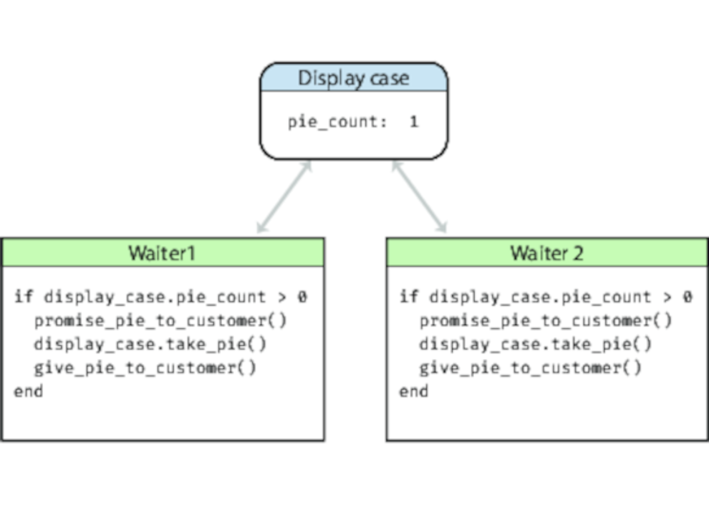

# 共享状态是不正确的状态
<!-- 2020.04.11 -->

您正在享用自己最喜欢的晚餐。 您吃完了主菜，然后询问服务员是否还有苹果派。 他转过头去在看到展示柜中还有一块，然后说是。 您点了它并满意地舒了口气。

同时，在餐厅的另一侧，另一个顾客向他们的服务员问了相同的问题。 她也看了看，确认还有一块，然后客户下了订单。

你们中的一个人即将会失望的。

把陈列柜的例子换成联合银行帐户，然后将工作人员变成销售点设备。 您和您的伴侣都决定同时购买一部新手机，但是帐户里面只有够买一部的钱。 某人（银行，商店或您）将非常不高兴。

问题就在共享状态。 餐馆中的每个服务员都在看陈列柜，而没有考虑其他情况。 每个销售点设备都会查看帐户余额，而不会考虑其他帐户。

---
## 提示 57 共享状态是不正确的状态
---

## 非原子更新
让我们看看我们的晚餐示例，就好像它是代码一样：



这两个服务员同时工作（在现实生活中，是并行的）。让我们看看他们的代码：

```ruby
if display_case.pie_count > 0
  promise_pie_to_customer()
  display_case.take_pie()
  give_pie_to_customer()
end
```

服务员 1 得到当前派的数量，发现是 1 个。他答应把派给顾客。但就在这时，服务员 2 跑了过来。她也看到派的数量是 1 个，于是向顾客做出同样的承诺。这时，其中一个抓住了最后一块派，另一个服务员进入了某种错误状态。

这里的问题不在于两个进程可以写到相同的内存。问题是两个进程都不能保证其对该内存的视图是一致的。实际上，当服务员执行 display_case.pie_count() 时，他们会将显示案例中的值复制到自己的内存中。如果显示案例中的值发生了变化，那么他们的内存（他们用来做决策的内存）现在已经过期了。

这都是因为取值，然后更新派的计数不是一个原子操作：中间的底层值会发生变化。

那么，如何才能让它成为原子化呢？

## 信号量和其他互斥形式
一个信号量只是一个一次只能由一个人拥有的东西。你可以创建一个信号量，然后用它来控制对其他资源的访问。在我们的例子中，我们可以创建一个信号量来控制对派的访问，并采用一个惯例，即任何想要更新派内容的人只能在持有该信号量的情况下才能更新。

假设食客决定用物理信号器来解决派的问题。他们在派的盒子上放了一个塑料信号。在任何服务员卖掉派之前，他们必须在手里拿着那个信号量。一旦他们的订单完成后（也就是把派送到餐桌前），他们就可以把小信号放回看守派宝藏的地方，准备调解下一个
订单。

我们用代码来看一下。非常经典地，抓取派的操作叫 P，释放派的操作叫 V。今天我们用的是锁/解锁、索赔/释放等术语。

```ruby
case_semaphore.lock()

if display_case.pie_count > 0
  promise_pie_to_customer()
  display_case.take_pie()
  give_pie_to_customer()
end

case_semaphore.unlock()
```

这段代码假设一个 semaphore 已经被创建并存储在变量 case_semapohore 中。

让我们假设两个服务员同时执行这段代码。他们都试图锁定 semaphore，但只有一个成功。得到 semaphore 的那一个继续正常运行。没有得到 semaphore 的那一个会被暂停，直到 semaphore 可用（服务员等待...）。当第一个服务员完成订单后，他们会解锁信号灯，第二个服务员继续运行。这时，他们看到箱子里没有派，就向顾客道歉。

这种做法有一些问题。可能最主要的问题是，它之所以有效，是因为每个人在使用派箱的时候，都会同意使用semaphore 的惯例。如果有人忘记了（也就是说，有些开发人员写的代码不遵循约定），那么我们又会陷入混乱。

### 让资源成为事务性的
目前的设计很差，因为它把保护派箱的访问权的责任交给了使用派箱的人。让我们改变一下，把这种控制权集中起来。要做到这一点，我们必须改变 API，让服务员在检查计数的同时，也可以在一次调用中取一块派的分量。

```ruby
slice = display_case.get_pie_if_available()

if slice
  give_pie_to_customer()
end
```

为了实现这个目标，我们需要写一个方法，作为显示案例本身的一部分来运行。

```ruby
if get_pie_if_available()
  if @slices.size > 0
    update_sales_data(:pie)
    return @slices.shift
  else
    false
  end
end
```

这段代码说明了一个常见的误区。我们把资源访问移到了一个中心位置，但我们的方法仍然可以从多个并发线程中调用，所以我们仍然需要用 semaphore 来保护它。

```ruby
if get_pie_if_available()
  @case_semaphore.lock()

  if @slices.size > 0
    update_sales_data(:pie)
    return @slices.shift
  else
    false
  end

  @case_semaphore.unlock()
end
```

即使是这样的代码也可能是不正确的。如果 update_sales_data 引发异常，那么 semaphore 将永远不会被解锁，未来所有对派箱的访问将无限期地挂起。我们需要处理这个问题：

```ruby
if get_pie_if_available()
  @case_semaphore.lock()

  try {
    if @slices.size > 0
      update_sales_data(:pie)
      return @slices.shift
    else
      false
    end
  }
  ensure {
    @case_semaphore.unlock()
  }
end
```

因为这是个很常见的错误，所以很多语言都提供了库来帮你处理。

```ruby
if get_pie_if_available()
  @case_semaphore.protect() {
    if @slices.size > 0
      update_sales_data(:pie)
      return @slices.shift
    else
      false
    end
  }
end
```

## 多种资源交易
我们的餐厅刚刚安装了一个冰激凌冰柜。如果顾客点了派，服务员需要检查派和冰淇淋是否都有。

我们可以把服务员的代码改成这样。

```ruby
slice = display_case.get_pie_if_available()
scoop = freezer.get_ice_cream_if_available()

if slice && scoop
  give_order_to_customer()
end
```

但这是行不通的 如果我们认领了一片派，但当我们想拿一勺冰淇淋时，却发现没有了，怎么办？我们现在只能拿着一些派，而我们却什么也做不了（因为我们的顾客一定有冰淇淋）。而事实上，我们拿着派的事实意味着它不在箱子里，所以它不能给其他不想要冰淇淋的顾客提供。

我们可以通过在盒子中添加一个方法来解决这个问题，让我们返回一片派。我们需要添加异常处理，以确保如果失败了，我们不会保留资源。

```ruby
slice = display_case.get_pie_if_available()

if slice
  try {
    scoop = freezer.get_ice_cream_if_available()
    if scoop
    try {
        give_order_to_customer()
    }
    rescue {
        freezer.give_back(scoop)
    }
    end
  }
    rescue {
    display_case.give_back(slice)
  }
end
```

同样，这也不太理想。现在的代码真的很难看：弄清楚它实际做什么是很难的：业务逻辑被埋没在所有的家务中。

之前我们通过将资源处理代码移到资源本身来解决这个问题。但在这里，我们有两个资源。我们应该把代码放在展示箱里还是放在冷冻箱里？

我们认为这两个选项的答案都是 "不"。实事求是的做法是说 "苹果派的模式 "是它自己的资源。我们会把这个代码移到一个新的模块中，然后客户端只需说 "给我拿个苹果派加冰激凌 "就可以了，不是成功就是失败。

当然，在现实世界中可能会有很多这样的复合菜，你不会想为每个菜都写新的模块。 反之，你可能会想要某种菜单项，其中包含对其组件的引用，然后有一个通用的 get_menu_item 方法，它可以与每个组件一起做资源的舞蹈。

## 非交易性更新
很多人都把共享内存作为并发问题的源头，但事实上，在你的应用程序代码共享可变资源的任何地方都可能出现问题：文件、数据库、外部服务等。每当你的代码的两个或多个实例可以同时访问某些资源时，你就会发现一个潜在的问题。

有时候，这个资源并不是那么明显。在写这本书的时候，我们更新了工具链，使用线程做更多的并行工作。这导致了构建失败，但以奇怪的方式和随机的地方导致了失败。所有错误中的一个共同点就是找不到文件或目录，尽管它们确实在正确的位置。

我们将其归结为代码中的几个地方临时改变了当前目录。在非并行版本中，这段代码将目录恢复回来已经足够好了。但在并行版本中，一个线程会改变目录，然后，当在这个目录中，另一个线程会运行。这个线程会期望在原来的目录中，但由于当前目录是线程之间共享的，所以情况并非如此。

这个问题的本质提示了另一个提示。

---
## 技巧 58 随机故障往往是并发问题
---

## 其他类型的独家访问
大多数语言都有库支持对共享资源的某种排他性访问。它们可以称之为mutexs(用于相互排斥)、监控器或semaphores。这些都是作为库来实现的。

然而，有些语言本身就内置了并发支持。例如，Rust 就强制执行了数据所有权的概念；一次只能有一个变量或参数持有对任何特定的可突变数据的引用。

你也可以说，功能语言由于其使所有数据不可变的倾向，使并发变得更简单。然而，它们仍然面临着同样的挑战，因为在某些时候，它们被迫进入到真实的、可变的世界。

## 医生，很痛。。。
如果你从这一节中没有其他的东西，那么请记住这一点：共享资源环境中的并发是很困难的，而自己管理它是充满挑战的。

这就是为什么我们推荐这个笑话的关键：

    医生，我这样做的时候会很痛。

    那就不要这样做。

接下来的几节建议大家用其他方法来获得并发的好处，而不是痛苦。

## 相关内容推荐
- 话题 38 [_巧合的编程_](../Chapter7/巧合的编程.md)
- 话题 28 [_解耦_](../Chapter5/解耦.md)
- 话题 10 [_正交性_](../Chapter2/正交性.md)
