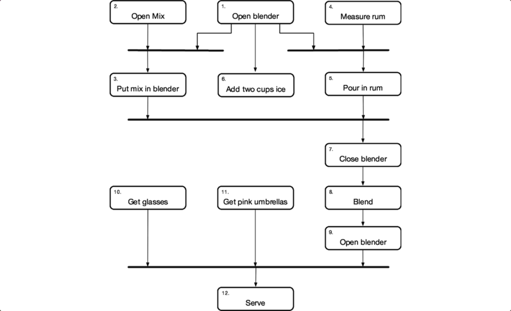

# 断开时间耦合
<!-- 2020.04.10 -->

您可能会问什么是 _时间耦合_。其实就是关于时间。

时间是软件体系结构中经常被忽略的方面。唯一困扰我们的是日程表上的时间，即直到发布之前剩下的时间，但这不是我们在这里谈论的。相反，我们正在谈论时间作为软件本身的设计元素的作用。时间对我们很重要，有两个方面：并发（事物同时发生）和排序（事物在时间上的相对位置）。

我们通常不会在考虑这两个方面的情况下进行编程。当人们第一次坐下来设计架构或编写程序时，事情往往是线性的。大多数人就是这样想的，先这样做，然后再这样做。但是以这种方式思考会导致时间耦合：时间耦合。必须始终在方法 B 之前调用方法 A；一次只能运行一份报告；您必须等待屏幕重新绘制，然后才能收到按钮点击的事件。滴答声必须先于滴答声发生。这种方法不是很灵活，也不是很现实。

我们需要考虑并发，并考虑将任何时间或订单依赖项解耦。这样，我们可以在许多开发领域（工作流程分析，体系结构，设计和部署）中获得灵活性并减少任何基于时间的依赖关系。结果将是系统更易于推理，可能会更快，更可靠地做出响应。

## 寻找并发
在许多项目中，作为设计的一部分，我们需要对应用程序工作流进行建模和分析。我们想找出可以同时发生的事情，以及必须严格执行的事情。一种做到这一点的方法是使用诸如活动图之类的符号来捕获工作流。

活动图由一组绘制为圆形框的动作组成。离开动作的箭头会导致另一个动作（可以在第一个动作完成后开始）或一条称为同步条的粗线。一旦完成进入同步栏的所有操作，您就可以沿着离开该栏的所有箭头进行操作。可以随时开始没有箭头的动作。

通过标识可以并行执行的活动，你可以使用活动图最大限度地提高并行。

---
## 提示 56 分析工作流程以提高并发
---

例如，我们可能正在为PiñaColada机器人制造商编写软件。 有人告诉我们这些步骤是：

|步骤|步骤|
|:--|--|
|1 打开搅拌机                 |1 关上搅拌机|
|2 打开 PiñaColada 混合       |2 液化 1 分钟|
|3 将混合物放入搅拌机           |3 打开搅拌机|
|4 测量 1/2 杯白朗姆酒         |4 拿玻璃杯|
|5 倒入朗姆酒                  |5 获取粉红色的雨伞|
|6 加 2 杯冰                  |6 服务|

但是，如果调酒师按顺序一步步执行这些步骤，他们将失去工作。 即使它们顺序地描述了这些动作，它们中的许多动作也可以并行执行。 我们将使用 活动图 来捕获并推断潜在的并发性。

睁大眼睛可以看到依赖项真正存在的地方。在这种情况下，顶级任务（1、2、4、10 和 11）可以同时并发发生。任务 3、5 和 6 稍后可以并行发生。如果您参加的是 piñacolada 制作大赛，这些优化措施可能会有所不同。

## 并发的机会
活动图显示了潜在的并发领域，但是对于这些领域是否值得利用没有什么可说的。例如，在 piñacolada 的示例中，调酒师需要五只手才能一次执行所有可能的初始任务。

这就是设计部分的内容。当我们查看活动时，我们意识到数字 8 液化将需要一分钟。在此期间，我们的酒保可以拿起玻璃杯和雨伞（活动 10 和 11），并且可能还有时间服务其他客户。

这就是我们在设计并发时要寻找的东西。我们希望找到需要时间的活动，但是在我们的代码中却没有时间。查询数据库，访问外部服务，等待用户输入：所有这些操作通常会使我们的程序停止运行，直到完成。这些都是做比 CPU 挥霍拇指更有效的工作的机会。

## 并行的机会
记住区别：并发是一种软件机制，而并行是一种硬件问题。如果我们在本地或远程有多个处理器，那么如果我们可以在其中分配工作，则可以减少总的处理时间。

以这种方式拆分的理想方法是相对独立的工作-每个工作都可以继续进行而无需等待其他任何事情。一种常见的模式是进行大量工作，将其分成独立的块，并行处理每个块，然后合并结果。

实际上，一个有趣的例子是 Elixir 语言的编译器的工作方式。启动时，它将正在构建的项目拆分为模块，并并行编译每个模块。有时一个模块依赖于另一个模块，在这种情况下，其编译会暂停，直到另一个模块的构建结果可用为止。顶级模块完成时，意味着所有依赖项都已编译。结果是可以利用所有可用内核的快速编译。

---
### 更快的格式化
这本书是用纯文本写的。要生成打印的版本，电子书或其他任何内容，请通过处理器管道来输入该文本。有些人寻找特殊的结构（参考书目引文，索引条目，技巧的特殊标记等）。其他处理器对整个文档进行操作。

流水线中的许多处理器必须访问外部信息（读取文件，写入文件，通过外部程序进行管道传输）。所有这些相对较慢的工作为我们提供了利用并发的机会：实际上，管道中的每个步骤都是并发执行的，从上一步读取并写入下一个步骤。

另外，进程的某些部分是处理器密集型的。其中之一是数学公式的转换。由于各种历史原因，每个方程式最多可能需要 500 毫秒才能转换。为了加快速度，我们利用了并行性。由于每个公式彼此独立，因此我们以各自并行的方式进行转换，并在结果可用时将其收集回书中。

结果，这本书在多核机器上的构建速度要快得多。

（而且，是的，我们在此过程中发现了许多并发错误……）

---

## 识别机会是容易的一部分
返回您的应用程序。 我们已经确定了可以从并发和并行中受益的地方。 现在到了棘手的部分：我们如何安全地实现它。 这是本章其余部分的主题。

## 相关内容包括
- 话题 26 [_如何平衡资源_](../Chapter4/如何平衡资源.md)
- 话题 28 [_解耦_](../Chapter5/解耦.md)
- 话题 10 [_正交性_](../Chapter2/正交性.md)
- 话题 36 [_黑板_](./黑板.md)

## 挑战
- 早上准备工作时，您并行执行多少个任务？ 您能在 UML 活动图中表达这一点吗？ 您能找到增加并发性的更快准备的方法吗？
