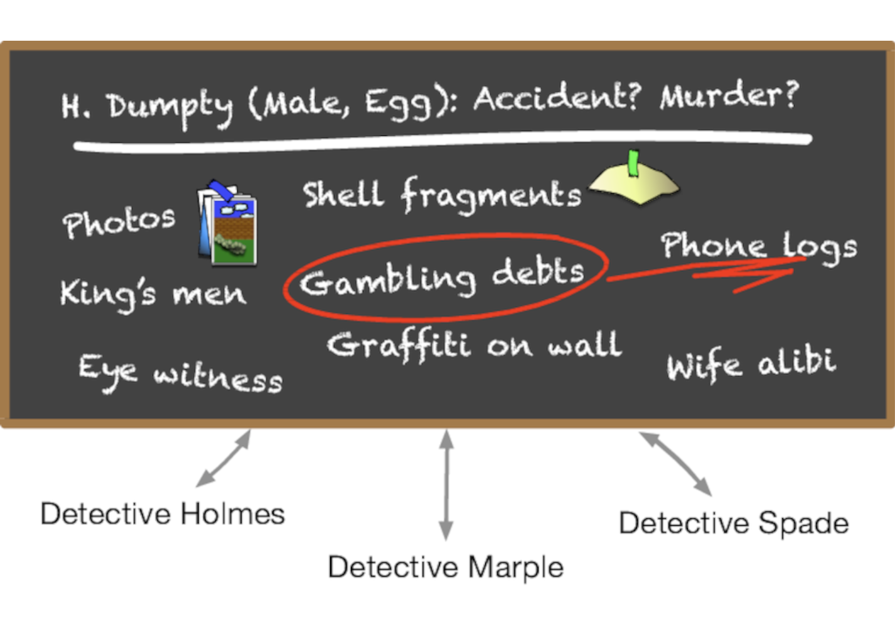

# 黑板
<!-- 2020.04.13 -->
> _写在墙上…_
>
> _-- 丹尼尔5（参考）_

你可能不会把 优雅 与警探联系在一起，而是想象出某种甜甜圈和咖啡的陈词滥调。但是，考虑一下警探们如何利用黑板来协调和解决一起谋杀案的调查。

假设总督察一开始在会议室里设置了一个大黑板。在上面，她写下了一个问题。

    H. Dumpty（男，鸡蛋）。意外？谋杀？

Humpty 真的是掉下去的，还是被人推倒的？每个警探都可以通过添加事实、目击者的证词、可能出现的任何法医证据等，为这个潜在的谋杀之谜做出贡献。随着数据的积累，警探可能会注意到其中的联系，并将观察到的情况或推测也发布出来。这个过程在所有的班次中，由许多不同的人和特工继续进行，直到结案。图为黑板样本。

有人发现了Humpty的赌债和电话记录之间的联系。也许是他接到了恐吓电话。

黑板法的一些主要特点是：

- 侦探们都不需要知道任何其他侦探的存在 ---- 他们会观察黑板上的新信息，并补充他们的发现。

- 侦探们可能受训于不同的学科，可能有不同的教育水平和专业知识，甚至可能不在同一个分局工作。他们有共同的破案愿望，但仅此而已。

-  不同的警探在破案过程中可能会来去匆匆，可能会有不同的轮班。

- 黑板上可以放的东西没有限制，可以是图片，可以是句子，也可以是物证等。

这是一种自由放任的并发。侦探是独立的进程、代理、actors 等。有些人把事实储存在黑板上。其他人会把事实从黑板上去掉，也许会合并或处理它们，然后在黑板上添加更多的信息。黑板逐渐帮助他们得出结论。

基于计算机的黑板系统最初是为人工智能应用而发明的，在人工智能应用中，需要解决的问题有大型复杂的语音识别、基于知识的推理系统等。

Gelertner 里的 Linda 是最早的黑板系统之一。它以键入的图元组的形式存储事实。应用程序可以将新的图元组写入 Linda 中，并使用一种模式匹配的形式查询现有的图元组。

后来出现了类似黑板的分布式系统，如 JavaSpaces 和 T Spaces。使用这些系统，你可以在黑板上存储活动的 Java 对象（而不仅仅是数据），并通过字段的部分匹配（通过模板和通配符）或子类型来检索它们。例如，假设你有一个类型 Author，它是 Person 的一个子类型。你可以通过使用一个 Author 模板来搜索包含 Person 对象的黑板，该模板的 lastName 值为 "Shakespeare"。你会得到比尔-莎士比亚这个作者，但不是弗雷德-莎士比亚这个园丁。

我们认为，这些系统从来没有真正起飞，部分原因是由于当时还没有发展出对并发合作处理的需求。

## 行动中的黑板
假设我们正在编写一个程序来接受和处理按揭或贷款申请。管理这个领域的法律非常复杂，联邦、州和地方政府都有自己的发言权。贷款人必须证明他们已经披露了某些事情，并且必须要求提供某些信息，但不能问某些其他问题，等等。

除了适用法律的混乱，我们还有以下问题需要解决。

- 数据到达的顺序无法保证。例如，查询信用检查或产权查询可能需要大量的时间，而姓名和地址等项目可能马上就可以得到。

- 数据收集工作可能由不同的人完成，分布在不同的办公室，在不同的时区。

- 有些数据收集可能是由其他系统自动完成的。这些数据也可能是异步到达的。

- 尽管如此，某些数据仍然可能依赖于其他数据。例如，你可能要等到拿到所有权或保险证明后才能开始查询汽车的所有权。

- 新数据的到来可能会带来新的问题和政策。假设信用检查回来的报告不是那么光彩夺目；现在你需要这五张额外的表格，也许还需要血样。

你可以尝试使用工作流程系统来处理每一种可能的组合和情况。许多这样的系统都存在，但它们可能很复杂，而且程序密集。随着法规的变化，工作流程必须重新组织：人们可能不得不改变他们的程序，硬接线的代码可能需要重新编写。

黑板与封装了法律要求的规则引擎相结合，是解决这里所发现的困难的优雅解决方案。数据到达的顺序无关紧要：当一个事实被发布时，它可以触发相应的规则。反馈也很容易处理：任何一组规则的输出都可以发布到黑板上，并触发更多适用的规则。

---
## 提示 60 使用黑板来协调工作流
---

## 信息系统可以像黑板一样
在我们写这本书第二版的时候，许多应用都是使用小型的、解耦的服务来构建的，它们都通过某种形式的消息传递系统进行通信。这些消息传递系统（如 Kafka 和 NATS）的作用远不止于简单地将数据从 A 发送到 B，特别是，它们提供了持久性（以事件日志的形式）和通过模式匹配的形式检索消息的能力。这意味着你可以把它们作为一个黑板系统和/或作为一个平台，在这个平台上运行一堆 actors。

## 但是，这并不是那么简单......
actor 和/或 黑板 和/或微服务的架构方法可以从你的应用程序中移除一整类潜在的并发问题。但这种好处是有代价的。这些方法比较难推理，因为很多动作是间接的。你会发现保持一个消息格式和/或 API 的中央存储库是有帮助的，特别是如果这个存储库可以为你生成代码和文档。你还需要有好的工具来追踪消息和它们在系统中的处理结果。一个有用的技术是在启动一个特定的业务函数时添加一个唯一的跟踪 ID，然后将其传播给所有参与的 actors）。然后你就能够从日志文件中重构发生的事情。

最后，这类系统的部署和管理可能会比较麻烦，因为有更多的活动部分。在某种程度上，这一点被系统更细化的事实所抵消，可以通过更换单个 actors 而不是整个系统来更新。

## 相关内容包括

- 话题 28 [_解耦_](../Chapter5/解耦.md)
- 话题 10 [_正交性_](../Chapter2/正交性.md)
- 话题 33 [_断开时间耦合_](./断开时间耦合.md)
- 话题 29 [_杂耍现实世界_](../Chapter5/杂耍现实世界.md)
- 话题 35 [_Actors和进程_](../Chapter/actors和进程.md)

## 练习

### 练习 23 （可能的答案）
对于以下每一种应用，黑板式系统是否合适？为什么？

- _图像处理_

  你想让多个并行进程抓取图像的大块，处理它们，然后将完成的大块放回去。

- _群组日历_

  你有很多人分散在全球各地，在不同的时区，说着不同的语言，试图安排一个会议。

- _网络监控工具_

  系统收集性能统计，收集故障报告。你要实现一些代理，利用这些信息来寻找系统中的故障。

## 挑战
- 在现实世界中，你是否使用黑板系统 -- 冰箱上的留言板，或者工作中的大白板？是什么让它们有效？信息发布的格式是否一致？这有什么关系吗？

