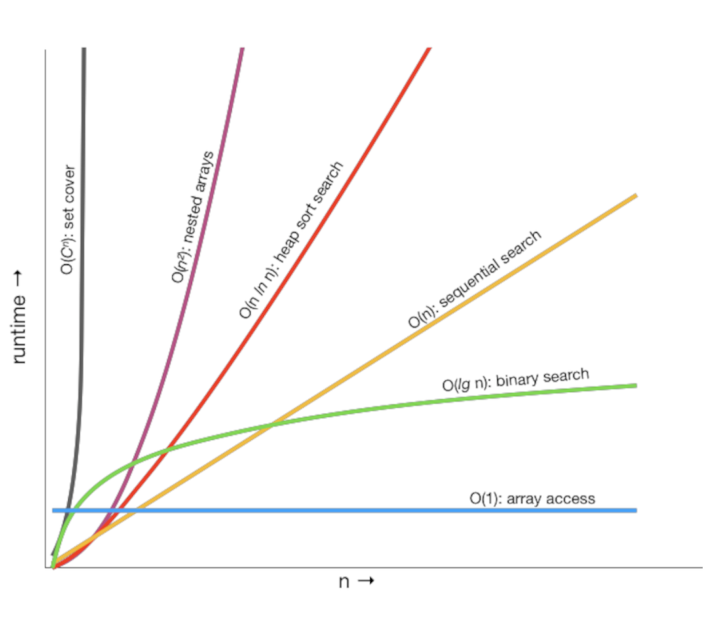

# 算法速度
<!-- 2020.04.17 -->

在话题 15 估计 中，我们讲到了估计的事情，比如走遍全城需要多长时间，或者一个项目需要多长时间才能完成。然而，还有另一种估算，实用型程序员几乎每天都在使用：估算算法使用的资源--时间、处理器、内存等。

这种估算往往是至关重要的。给定一个选择，你会选择哪一种方法来做某件事，你会选择哪一种？你知道你的程序在1000 条记录下运行多久，但如何扩展到 1000 万条记录？代码中的哪些部分需要优化？

事实证明，这些问题往往可以用常识、一些分析，以及一种叫做 "大O" 的近似值的书写方法来回答。

## 我们所说的估算算法是什么意思？
大多数非琐碎的算法都会处理某种可变的输入---排序 n 个字符串、反转一个 m * n 的矩阵，或者用 n 位密钥解密消息。通常情况下，这种输入的大小会影响算法：输入越大，运行时间越长，或者使用的内存越多。

如果这种关系始终是线性的(这样，时间就会与 n 的值成正比增加)，这部分就不重要了。然而，大多数重要的算法都不是线性的。好消息是，很多都是亚线性的。比如说，二分查找，在找到匹配的时候不需要看每一个候选者。坏消息是，其他的算法比线性算法差得多；运行时间或内存需求的增加速度远比 n 要大得多。 一个需要一分钟处理 10 个项目的算法可能要花上一辈子的时间来处理 100 个项目。

我们发现，每当我们写任何包含循环或递归调用的东西，我们都会下意识地检查运行时间和内存需求。这很少是一个正式的过程，而是快速确认我们在这种情况下所做的事情是合理的。然而，我们有时确实会发现自己要进行更详细的分析。这时，Big-O 记号法就派上了用场。

## Big-O 记号法
Big-O 记号，写成 O()，是一种处理近似值的数学方法。当我们写出一个特定的排序例程对 n 条记录进行排序时，需要大概 O( n * n ) 我们只是说，最坏的情况下所花费的时间会随着 n 的平方而变化，记录的数量增加一倍，时间大约会增加四倍。把它看作是在 O 的顺序上的意思。

O () 记号把我们所测量的东西（时间、内存等）的值设为上限。如果我们说一个函数需要 O(n * n) 时间，那么我们知道它所需要的时间的上界不会比 n * n  大， 有时我们会得出相当复杂的 O() 函数，但由于最高阶的项会随着 n 的值增加而支配着数值，所以惯例是去掉所有的低阶项，而不需要显示任何常数乘法。

    O(n * n/2 + 3n)   跟 O(n * n/2)  跟  O(n * n)  都一样

这实际上是 O (n) 记号法的一个特点，一个 O (n * n) 算法可能比另一个 O (n * n) 算法快 1000 倍，但你不会从记号法中知道。Big-O 永远不会给你实际的时间或内存或其他什么的数字：它只是告诉你这些值会随着输入的变化而变化。

图 3，各种算法的运行时间，显示了你会遇到的几种常见的 O () 记号，以及每类算法的运行时间比较图。很明显，一旦过了 O (n2) 这关，事情很快就开始失控了。

|||
|:--:|:--:|
|O(1)|常量（访问数组中的元素，简单语句|
|O(lgn)|对数（二进制搜索）。对数的基数并不重要，所以这相当于 O (logn)|
|O(n)|线性(顺序搜索)|
|O(nlgn)|比线性差，但也差不了多少。(快速排序、堆排序的平均运行时间)|
|O (n * n)|平方（选择和插入排序）|
|O(n * n * n)|立方（两个 n * n 矩阵的乘积）|
|O(c的n次方)|指数法（巡回推销员问题，集分法)|

    <h3>图3.各种算法的运行时间</h3>

例如，假设你有一个例程，处理 100条 记录需要 1 秒。处理 1000 条记录需要多长时间？如果你的代码是 O (1)，那么它仍然需要一秒钟。如果是 O (lg(n))，那么你可能要等 3 秒左右。 O (n) 会显示线性增加到十秒，而 O (nlg(n)) 则需要 33 秒左右。如果你运气不好，有一个 O (n * n) 的例程，那么在它做它的事情的时候，你可以再等 100秒。如果你使用的是指数级别的算法 O (2 的 n 次方)，你可能会想喝杯咖啡--你的例程应该在 10256 年内完成。让我们知道宇宙是如何结束的。

O() 符号不只适用于时间，你可以用它来表示算法使用的任何其他资源。例如，通常情况下，能够对内存消耗进行建模是非常有用的（参见练习中的例子）

## 常识性估算
你可以用常识估算出许多基本算法的顺序。

_简单的循环_

    如果一个简单的循环从 1 到 n 运行，那么算法很可能是 O(n) - 时间随 n 线性增加。

_嵌套循环_

    如果你在另一个循环中嵌套一个循环，那么你的算法就会变成 O(m * n)，其中 m 和 n 是两个循环的极限。这种情况通常发生在简单的排序算法中，比如冒泡排序，外循环依次扫描数组中的每个元素，内循环计算出该元素在排序结果中的位置。这样的排序算法往往是O(n * n)。

_二进制切分算法_

    如果你的算法在每次循环时将其考虑的东西集减半，那么它很可能是对数，O(lg(n)) 对一个排序列表的二进制搜索，遍历二进制树，找到机器字中的第一个集位，都可以是O(lg(n))。

_分而治之_

    将输入进行分区，对两部分独立工作，然后合并结果的算法可以是 O(nlg(n))。最经典的例子是快速排序，它的工作原理是将数据分成两半，然后递归排序。虽然从技术上讲是 O(n * n)，但由于它的行为在被送入排序的输入时性能会下降，所以快速排序的平均运行时间是 O(lg(n))。

_组合式_

    每当算法开始关注事物的重复运算时，它们的运行时间可能会失控。这是因为 permutations 涉及到因式（有5！= 5 * 4 * 3 * 2 * 1 = 120 个从 1 到 5 的数位数的 permutations）。对 5 个元素的组合式算法进行计时：运行 6 个元素的算法需要 6 次，运行 7 个元素的算法需要 42 次。例子包括许多公认的硬问题的算法--旅行推销员问题，把东西最好地打包到一个容器里，把一组数字分区，使每一组的总和相同，等等。通常情况下，启发式算法被用来减少这些类型的算法在特定问题领域的运行时间。

## 算法速度在实践中的应用
    在你的职业生涯中，你不太可能花很多时间来写排序例程。你可以使用库中的那些，可能会比你不费吹灰之力就能写出的东西都要好。然而，我们之前描述的基本类型的算法会一次又一次地出现。每当你发现自己写了一个简单的循环，你就知道你有一个 O(n) 算法。如果这个循环包含了一个内循环，那么你就会看到 O(m*n)。你应该问自己，这些值能有多大。如果这些数字是有边界的，那么你就知道代码要运行多长时间。如果这些数字取决于外部因素（比如一夜之间批处理运行的记录数，或者是人名列表中的名字数），那么你可能要停下来考虑一下大值可能对你的运行时间或内存消耗的影响。

---
## 提示 63 估计你的算法的顺序
---

有一些方法你可以采取一些方法来解决潜在的问题。如果你有一个算法是 O(n * n)，试着找一个分而治之的方法，可以把你的算法降到 O(nlg(n))。

如果你不确定你的代码需要多长时间，或者不确定它将使用多少内存，可以尝试运行它，改变输入记录的数量或其他可能影响运行时间的东西。然后将结果绘制出来。你应该很快就会对曲线的形状有一个很好的想法。它是向上弯曲，是一条直线，还是随着输入量的增加而变平？三四个点应该可以让你有一个想法。

此外，还要考虑你在代码本身所做的事情。一个简单的 O(n * n) 循环可能比一个复杂的 O(nlg(n)) 循环在较小的值上表现得更好，特别是如果 O(nlg(n) 算法有一个昂贵的内循环。

在所有这些理论中间，不要忘记还有一些实际的考虑。对于小的输入集，运行时间看起来可能会线性增加。但是，如果给代码喂入数百万条记录，时间会突然退化，因为系统开始颤动。如果你用随机输入键测试一个排序例程，你可能会在第一次遇到有序输入时感到惊讶。务实的程序员尽量把理论基础和实践基础都涵盖了。在做了这么多估计之后，唯一重要的时机就是你的代码在生产环境中运行的速度，用真实的数据来衡量。这就引出了我们的下一个提示。

---
## 提示 64 测试你的估计值
---

如果要获得准确的时序很难，可以使用代码分析器来计算算法中不同步骤的执行次数，并将这些数字与输入的大小进行对比。
最好的不一定是最好的

你还需要务实地选择合适的算法--最快的算法不一定是最好的。在一个小的输入集中，直接的插入排序算法和快速排序算法表现得一样好，而且编写和调试所需的时间也更短。如果你选择的算法具有较高的设置成本，你也需要小心。对于小的输入集，这样的设置可能会使运行时间相形见绌，使算法不合适。

同时要警惕过早的优化。在投入宝贵的时间去尝试改进算法之前，确定一个算法真的是瓶颈，这总是一个好主意。

## 相关内容包括
- 话题 15 估计

## 挑战
- 每个开发者都应该对算法的设计和分析有一定的感悟。Robert Sedgewick 在这方面写了一系列通俗易懂的书（Algorithms [SW11] An Introduction to the Analysis of Algorithms [SF13]等）。我们建议将他的书加入到你的收藏中，并将其作为阅读的重点。

- 对于那些喜欢比 Sedgewick 提供的更多细节的人来说，可以阅读 Donald Knuth 的《计算机编程的艺术》(Art of Computer Programming)一书，这本书分析了各种算法。计算机编程的艺术》（The Art of Computer Programming: 基础算法[Knu97] 《计算机程序设计的艺术》第2卷：Seminumerical Algorithms [Knu97a] 《计算机程序设计的艺术》第3卷：排序和搜索[Knu98] 《计算机程序设计的艺术》第4A卷：组合算法，第1部分[Knu14]。

- 在接下来的第一个练习中，我们来看看对长整数的数组进行排序。如果密钥比较复杂，而且密钥比较的开销很高，会有什么影响？密钥结构是否会影响排序算法的效率，还是说排序速度最快的总是最快的？

## 练习
### 练习 27（可能的答案）
我们用 Rust 编码了一组简单的排序例程。在你现有的各种机器上运行它们。你的数字是否遵循了预期的曲线？你可以推断出你的机器的相对速度是多少？各种编译器优化设置的影响是什么？

### 练习 28（可能的答案）
在常识性估算部分，我们声称一个二分算法的时间是 O(lg(n))，你可以证明它吗？

### 练习 29（可能的答案）
在图 3，各种算法的运行时间中， 我们声称 O(lg(n)) 跟 O(log10n) 是一样的（或对数到任何基数），你能解释为什么吗?
