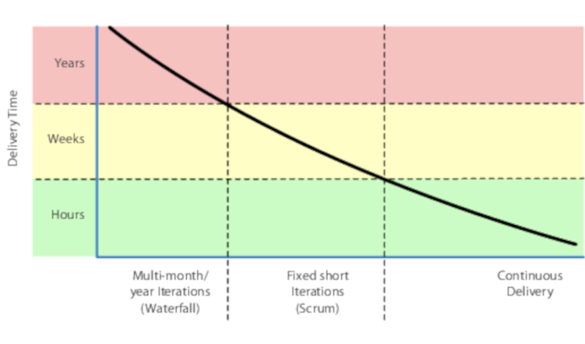

# 椰子不要切碎
<!-- 2020.04.27 -->

土生土长的岛上居民之前从来没有见过一架飞机，也没有遇到过这样的陌生人。作为对土地使用权的回报，这些陌生人提供的机械鸟(指飞机)整天在跑道上飞进飞出，给他们的岛屿家园带来了惊人的物质财富。陌生人提到了一些关于战争和战斗的事情。有一天战争结束他们都带着他们的奇特财富离开了。

岛民们不顾一切地想恢复自己的好运气，用当地的材料：藤蔓、椰壳、棕榈树叶之类的东西，重新建造了一个仿制的机场、控制塔和设备。但是不知道为什么，尽管他们把所有的元素都准备好了，但飞机却没有来。他们模仿了形式，却没有模仿内容。人类学家称这为货物崇拜。

很多时候，我们就是岛上的人。

很容易也很有诱惑力我们落入货物崇拜的陷阱：通过投资和堆砌那些容易看得到的神器，希望能吸引到底层的、能起作用的法宝。但就像美拉尼西亚的原始货运崇拜一样，用椰子壳做成的假机场也不能代替真货。

比如说，我们亲眼见过宣称自己在使用 Scrum 的团队。但是仔细观察后发现，原来他们每天都在做每周一次的站立会议，四周的迭代往往会变成六周或八周的迭代。他们觉得这样做还可以，因为他们使用的是一种流行的 "敏捷" 排程工具。他们
只是投资于表面的人工智能，即使是这样，也往往是名存实亡，仿佛 "站起来" 或 "迭代" 是迷信者的某种咒语。不足为奇的是，他们也没能吸引到真正的魔力。

## 背景的重要性
你或你的团队是否落入了这个陷阱？扪心自问，你甚至为什么要使用那种特定的开发方法？还是那个框架？或者是那个测试技术？它是否真的很适合当前的工作？它对你的工作是否有效？还是只是因为最新的互联网成功案例采用了它？

目前有一种趋势是采用 Spotify、Netflix、Stripe、GitLab 等成功公司的策略和流程。在软件开发和管理方面，他们各自都有自己独特的做法。但考虑一下背景：你们是否处于同一个市场，有相同的限制和机会，相似的专业知识和组织规模，相似的管理，相似的文化？类似的用户群和需求？

---
### 要像他们一样!
我们经常听到软件开发的领导者告诉他们的员工 "我们应该像 Netflix 一样运营"（或者其他这些领先的公司之一）。你当然可以这么做。

首先，让自己拥有几十万的服务器和几千万的用户......

---

不要上当受骗。仅仅有特定的神器、表面的结构、策略、流程、方法是不够的。

---
## 提示 87 做有用的东西，而不是时髦的东西
---

你怎么知道 "什么是有效的？" 你依靠的是最基本的实用技术：

试一试。

用一个或一组小团队来试行这个想法。保留那些看起来效果不错的好的部分，把其他作为浪费或开销的东西丢掉。没有人会因为你的组织运作方式与 Spotify 或 Netflix 不同而降低你的组织，因为即使是他们在成长的时候也没有按照他们目前的流程来做。而多年以后，当这些公司成熟、转折并继续茁壮成长的时候，他们又将会再次做一些不同的事情。

这就是他们成功的真正秘诀。

## 一刀切并不合身
软件开发方法论的目的是帮助大家一起工作。正如我们在话题 47 [_敏捷的本质_](../Chapter8/敏捷的本质.md) 中讨论的那样，当你在开发软件的时候，没有一个单一的计划可以遵循，尤其是别人在别的公司想出来的计划，你就更不可能遵循。

很多认证计划实际上比这更糟糕：它们的前提是学生能够背诵和遵循规则。但这不是你想要的。你需要的是能够看清现有规则之外的东西，并利用各种可能性来获取优势。这和 "但是 Scrum/Lean/Kanban/XP/agile 是这样做的........... "之类的心态完全不同。

相反，你要从任何一个特定的方法论中提取最好的部分，并对其进行调整使用。没有一刀切的方法，而且目前的方法还远未完善，所以你需要关注的不仅仅是一种流行的方法。

例如，Scrum 是一套有用的项目管理实践。然而，Scrum本身并不能在技术层面为团队提供足够的指导，也不能在组合/治理层面为领导层提供足够的指导。那么你该从哪里开始呢？

## 真正的目的
当然，我们的目标不是 "做Scrum"、"做敏捷"、"做精益" 或是其他。我们的目标是要在一瞬间就能提供给用户一些新能力的工作软件。不是几周、几个月或几年后，而是现在。对于许多团队和组织来说，持续交付感觉是一个高不可攀的目标，尤其是当你的流程将交付时间限制在几个月甚至几周的时候。但与任何目标一样，关键是要保持正确的方向。

如果你是以年为单位进行交付，那就尽量把周期缩短到几个月。从几个月缩短到几周。从四周的冲刺，尽量缩短为两周。从两周的冲刺，尝试一个。然后是每天。然后，最后是按需交付。注意，能够按需交付并不意味着你必须每天每时每刻都要交付。你要在用户需要的时候，当这样做是有商业意义的时候，你才去交付。

---
## 提示 88 在用户需要的时候交付
---

为了转到这种持续开发的风格，你需要一个坚如磐石的基础架构，这一点我们在话题 50 [_实用入门套件_](./实用入门套件.md) 中讨论。你在版本控制系统的主干中进行开发，而不是在分支中进行开发，并使用功能切换等技术有选择地向用户推出测试功能。

一旦你的基础架构做好了，你需要决定如何组织工作。初学者可能想从 Scrum 开始项目管理，再加上极限编程（XP）的技术实践。更严谨、更有经验的团队可能会把目光投向看板和精益技术，既可以解决团队的问题，或许也可以解决更大的治理问题。

但不要相信我们的话，自己去调查和尝试这些方法。不过要小心过头了。过度投资于任何特定的方法，会让你对其他方法视而不见。当你习惯于此。很快你就会变得很难看到任何其他的方法。你已经钙化了，现在你已经无法快速适应了。

还不如用椰子呢。

## 相关内容包括
• 话题 27 [_别开过头了_](../Chapter4/别开过头了.md)
• 话题 48 [_务实的团队_](./务实的团队.md)
• 话题 12 [_示踪子弹_](../Chapter2/示踪子弹.md)
• 话题 50 [_实用入门套件_](./实用入门套件.md)
• 话题 47 [_敏捷的本质_](../Chapter8/敏捷的本质.md)
